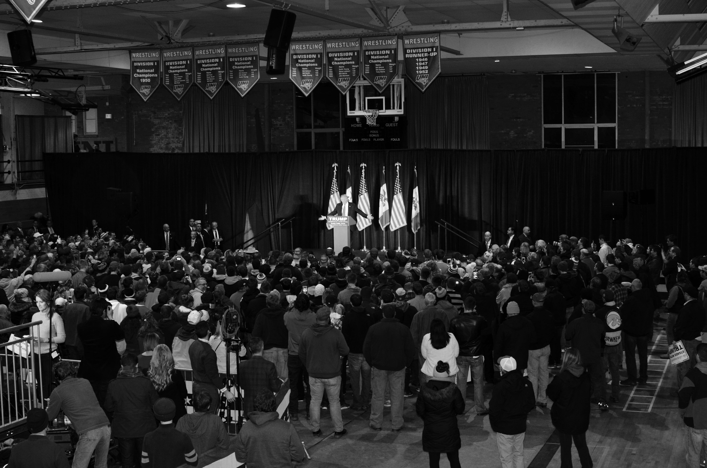
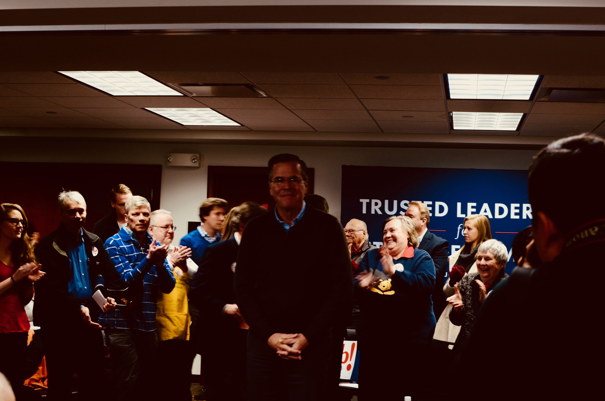

```{r setup, include=FALSE}
knitr::opts_chunk$set(echo = FALSE)
```

*Sincere thanks to Bec, Callam, Monica, and Owen for reading and improving these notes.*

Bernie Sanders seems quite reasonable for a revolutionary. An energetic man of 74, he spoke for an hour in Perry, Iowa, to a room of 300 from only a few lines of handwritten notes, and then fielded half an hour of questions. He does not have the same aura that surrounded, then, Senator Obama in his own Iowa battle with, then, Senator Clinton in 2008 say those who saw both. Instead, Sanders has preternatural calm. 

```{r fig.cap="Photo of Bernie Sanders and audience at Perry, Iowa, by Monica Alexander."}
knitr::include_graphics("images/2016_01_11_Bernie.jpg")
```

So much calm, in fact, that some audience members who walked into the auditorium undecided, walked out excitedly supporting Sanders' 'socialist' revolution. His revolution includes, amongst other features, universal medical coverage, paid maternity leave and a $15 hourly minimum wage; hardly revolutionary notions in many developed countries. For instance, few politicians that are against these policies get elected in Australia. However, Sanders will test whether a politician who supports them can get elected in the US.

Much has been made of Sanders' recent polling. But the Iowa Caucasus, especially for Democrats, are a test not just of support, but enthusiasm and strength of will. Participants do not vote, they caucus. This means they gather with their neighbours and publicly indicate their support of a candidate - sometimes by raising a hand, sometimes by moving to a side of a room. Supporters must resist peer pressure, and continue supporting their candidate even as others try to sway them. 

In addition to popularity, winning in Iowa requires organisation and attention to detail. This is why the operatives of Secretary Clinton, who is 68, remain content despite the polls. Caucusing is onerous, especially for those with children or without transport. A campaign is only as good as the number of supporters that it can get to turn up on the night. Clinton operatives are quick to mention their advantage in terms of this 'ground game'. 

Clinton's ground game advantage is partly due to experience, but it is also due to money. Sanders unexpectedly raised $33 million in the final quarter of 2015, which compares favourably with Clinton's \$37 million, but Clinton has other sources of financial support. Sanders' supporters should hope that the evident lack of preparation at the event in Perry, Iowa, itself (for instance, Sanders had to repeatedly ask for water as none had been left on the podium, nearly losing his voice on occasion) are not indicative of broader organisational oversights.

```{r fig.cap="Photo of Trump protesters."}
knitr::include_graphics("images/2016_01_12_Trump_1.jpg")
```

Donald Trump is different. More than a thousand people watched Trump, who is 69, speak in Cedar Falls, Iowa. Almost all were white. What he lacks in substance or structure, Trump makes up for with self-confidence. For 40 minutes he verbally picked at this and that, discussing polls, as well as goading opponents via 'hypotheticals' and name-calling. The audience was allowed no questions.

```{r fig.cap="Photo of Donald Trump at Cedar Falls, Iowa, by Monica Alexander."}

```

Trump does not campaign in poetry (although he did literally recite song lyrics) and he seems unlikely to govern in prose. His operatives were clad in ill-fitting suits and shiny leather shoes that looked newly purchased. These 'Storm Trumpers' were unfailingly polite, but nonetheless menacing. The loudspeaker request, moments before Trump spoke, to not physically harm protesters was chilling rather than reassuring, not least since it was followed by laughter from the crowd. The comfort of knowing that the Secret Service would have confiscated any knives or guns at the door was relative rather than absolute. [Edit 26/1/16: Trump has since asserted that he could shoot somebody and not lose any voters. You get the uneasy sense that it would be better for his theory to remain untested, for fear that he may onto something.]

```{r fig.cap="Photo of Donald Trump audience at Cedar Falls, Iowa, by Monica Alexander."}
knitr::include_graphics("images/2016_01_12_Trump_3.jpg")
```

Trump's political inexperience seems matched by that of his supporters. His warm-up acts (one of whose qualification, as she explained, was being a runner-up on The Apprentice) spent considerable time explaining the importance of turning out to caucus on 1 February. Unlike the Democrats, Republican caucus-goers do not have to be as resistant to peer pressure - secret ballots are possible. But much of the crowd seemed new to the political process, and getting each of them to turn out, and in some cases register as Republican, may be too much to expect. If so, then it is likely that Senator Ted Cruz, a 45-year-old conservative Republican from Texas, will prevail.

```{r fig.cap="Photo of Trump at Cedar Falls, Iowa, by Monica Alexander."}

```

For all their differences, it is the same anger that propels Sanders and Trump toward the top of the polls. Neither candidate is an establishment member of their respective parties – Sanders only joined earlier this year despite having generally voted with the Democrats as a senator, and Trump appears to swear allegiance only to himself. It is the feeling of being let down by the status quo, of the system needing a catalyst for something more, that drives their popularity. 

While Sanders' policies may not make much difference for today's caucus-goers, he speaks to their concern that their children's lives may not be better than their own. His is an appeal for hope. Trump's appeal is to those who feel they are worse off now than they were in the past. He gives them someone to blame, and provides solutions such as tariffs and walls, that some see as plausible. Perhaps for Sanders the glass is half-full; for Trump, half-empty?

The economic reality is that feeling worse off is reasonable for many Americans. After accounting for inflation the 2014 measure (which is the most recent one) of American household median income is lower than it was in 1997. And, as both Trump and Sanders accurately explained to their audiences, the 5 per cent unemployment rate that President Obama appeals to as a measure of his success is artificially low because some have given up looking for work.

Those suffering most from the success of Sanders and Trump are candidates such as John Ellis Bush. Jeb, 62, seems to have carefully studied the art of coming across as a nice guy, albeit one who is a little annoyed about having to speak to about 200 people in Coralville, Iowa. Being a Bush comes with baggage and expectations, but it does have its advantages, such as immaculate event advance work and plenty of press.

```{r fig.cap="Photo of Jeb! at Coralville, Iowa, by Monica Alexander."}

```

Jeb emphasised his commander-in-chief credentials. His older brother's war in Iraq may have ensured that the age of aggressive American imperialism is over for now, but Jeb was still introduced by a retired Admiral who spoke of Jeb's leadership fighting hurricanes in Florida and neighbouring states. 

```{r fig.cap="Photo of Jeb! at Coralville, Iowa, by Monica Alexander."}
knitr::include_graphics("images/2016_01_12_Jeb_2.jpg")
```

The crowd was lively and Jeb was frequently interrupted by cheers. He spoke without notes for about 30 minutes to a crowd surrounding him on all four sides. Maybe this is a plan to seem more approachable, or to encourage audience participation? An hour of questions, courtesy of roaming microphones, followed. Jeb worked hard to be nice, but it was apparent that he was, indeed, working at it, because he occasionally lapsed and gently made fun of a questioner. 

For all the well-acknowledged flaws of presidential systems in general, and the US one specifically, it has much to be proud of. Every candidate for their party's nomination will visit Iowa at some stage this week, many visiting multiple towns in a day. The scrutiny is intense. Iowa is a state of 3 million people, divided into 99 counties, and by 1 February, many candidates will have visited every county. 

```{r fig.cap="Photo in Iowa, by Monica Alexander."}
knitr::include_graphics("images/2016_01_12_Iowa_1.jpg")
```

If one were starting from scratch, the Iowa Caucuses would probably not be the way to go. Iowa is not representative of the rest of the United States, and its outsized electoral importance skews national policy. But in their own way, the Iowa Caucuses are valuable. In general, the nature of the candidates seems to come through in the events because they are so intimate. Given that so much of leadership consists of reacting to unexpected events, and the difficulty that politicians tend to have implementing their desired policies, perhaps this is the most important consideration. It may be that, to rework Churchill's aphorism, the Iowa Caucuses are the worst way to select presidential candidates, apart from all the others.

```{r fig.cap="Photo in Iowa, by Monica Alexander."}

```

There are many aspects of the United States that should not be considered, let alone encouraged, in Australia. But the rigorous examination of candidates facilitated by the Iowa Caucuses is something Australia should emulate.


