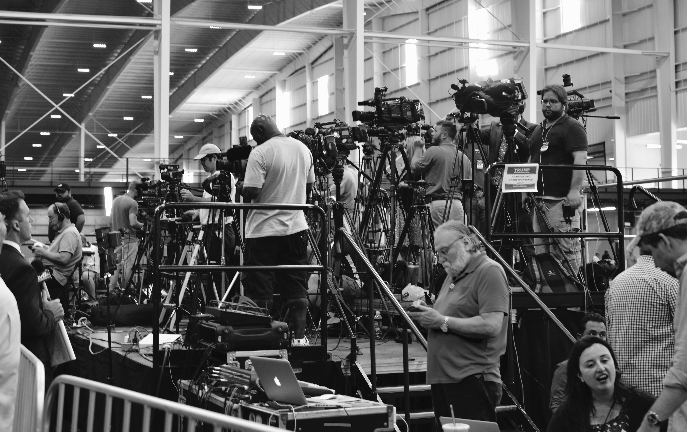

```{r setup, include=FALSE}
knitr::opts_chunk$set(echo = FALSE)
```

**(Comment 4 July 2017: Like much of my writing about Trump, the opinions here haven't aged too well. Nonetheless, I learnt a lot from writing this and later from thinking about why I went wrong.)**

*A few notes and photos from a Trump rally in Indiana earlier this week. The focus is on whether Trump 'could' win the election in November. In the interest of transparency, it's worth acknowledging that I didn't think Trump could win the Republican nomination. Thanks to Monica for helpful edits.*

```{r}
knitr::include_graphics("images/2016_07_17_Children.jpg")
```

Donald Trump is an improved politician, but it's unlikely to be enough. He has harnessed fervent anti-Clinton sentiment amongst Republicans. But he does not have time to build the coalitions usually needed to win a US presidential election.

At a recent rally in Westfield, Indiana, Trump was comparatively structured and measured. There was less name-calling and little of the ludicrous hypotheticals that characterized a January rally in Iowa.[^1] [^2] Some things haven't changed: the crowd is still overwhelmingly white; 'Storm Trumpers' in ill-fitting suits are still on patrol; and Trump still lies.[^3] But he is no longer politically inexperienced, and neither were the Trump supporters that I talked to. 

```{r}

```

The Republican Governor of Indiana, Mike Pence, introduced Trump at the rally. Pence was later announced as Trump's running mate. If Trump is to win the election then he needs to easily win states such as Indiana, where Republicans have only lost once in the past fifty years.[^4] Even though the outcome in Indiana should not be in doubt, Hoosier Republicans are important. Trump needs fired-up volunteers to travel to neighboring Ohio, a crucial swing state, and Trump needs money. But mostly, Trump needs friends.

Despite Trump's improvement as a politician, winning a presidential election usually requires constructing coalitions. Often this is the work of a lifetime. For instance, Richard Ben Cramer describes how, beginning in his 20s, George H. W. Bush built a Christmas card list. By the time he was Vice President 30,000 'friends' received an annual Christmas card from him.[^5] The Clintons have been building coalitions since their 20s too. Part of Trump's appeal is that he has only been a politician for a year, but his campaign is inefficient without coalitions.

```{r}
knitr::include_graphics("images/2016_07_17_TrumpSpeaking.png")
```

The most precious resource in any election is a candidate's time. The US presidential election magnifies this because of the scrutiny, the electoral college, and the size of the country. Yes, a candidate needs to raise money, motivate supporters, and convince undecided voters. But to stand a chance of winning, a candidate usually also needs coalitions that can do all this for them. Without these, there is more pressure on Trump.

Trump has also only recently put modern campaign essentials in place. For instance, just a few months ago Trump described the use of data in politics as 'overrated'.[^6] But he seems to have changed his mind: Trump collected and verified the phone numbers of those who attended the rally in Indiana. Texts and phone calls will be critical to the effort of getting his supporters to turn out to vote in November. Trump is also now sending emails but it takes time to build a high-quality list. 

```{r}
knitr::include_graphics("images/2016_07_17_TrumpCap.jpg")
```

The Trump supporters that I spoke to were unfailingly polite. They conscientiously thanked the many law enforcement personnel, and there were many military veterans in the audience. No one supported every aspect of Trump's platform, but this is not unusual in political campaigns. There was some anti-Muslim sentiment, and a few conspiracy theories. Political correctness was a recurrent issue, as was declining US influence in the world. Although Trump uses 'The Wall' as a call-and-response device (Trump: 'Who's going to pay for the wall?' Crowd: 'Mexico'), anti-Mexican sentiment seemed to be driven more by a perceived willingness of Hispanics to work for low wages than racism.

The Republicans I talked to were united only in being against Clinton; but similarly many Democrats seem united only in wanting to stop Trump. How such a campaign translates into votes is unclear. While there don't seem to be many undecided voters, there are many dejected ones. It will be interesting to see turnout estimates in swing states. Would you stand in line to vote against, rather than for, a candidate?

```{r}
knitr::include_graphics("images/2016_07_17_TrumpAndPhone.jpg")
```

In just one year Trump has changed US politics. He is quickly improving as a politician, but remains divisive. Is Trump the moment, or just of the moment? Although he probably does not have enough time to do the work that would allow him to win in November,[^7] the impact of his campaign will be felt for many years.


[^1]: Go to https://www.rohanalexander.com/2016/01/14/notes-and-photos-from-iowa/ for that write-up.

[^2]: The speech can be viewed here: https://youtu.be/ewMhP-V1ed8, as at 15 July 2016. 

[^3]: See, for instance, Politifact (http://www.politifact.com/personalities/donald-trump/) which awarded Trump PolitiFact's 2015 Lie of the Year and rules 58 per cent of his statements as either 'False' or 'Pants on Fire'.

[^4]: See the entry for Indiana here: https://en.wikipedia.org/wiki/List_of_United_States_presidential_election_results_by_state, as at 15 uly 2016. 

[^5]: See Richard Ben Cramer's 'What It Takes', page 153 of the Vintage; Reprint edition (June 1, 1993).

[^6]: See: http://bigstory.ap.org/article/6d588a38061c4657a557d1dde86782ec/trumps-questioning-value-data-worries-republicans, accessed 15 July 2016.

[^7]: It is estimated that Trump currently has a 20-40 per cent chance of winning the election. For instance, see the Five Thirty Eight election forecast (http://projects.fivethirtyeight.com/2016-election-forecast/), as at 15 July 2016 or the New York Times summary of election polls (http://www.nytimes.com/interactive/2016/us/elections/polls.html), again as at 15 July 2016.


