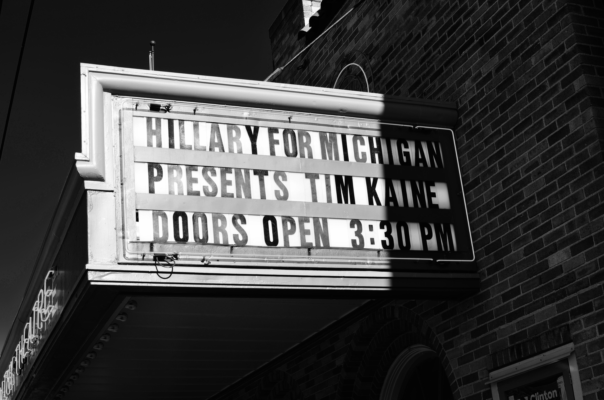
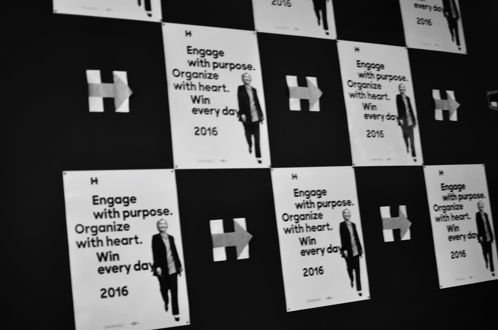
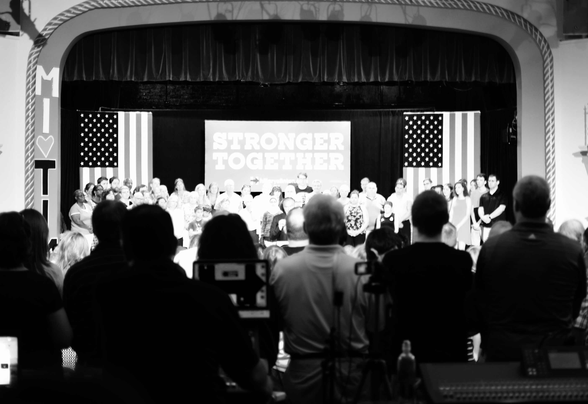
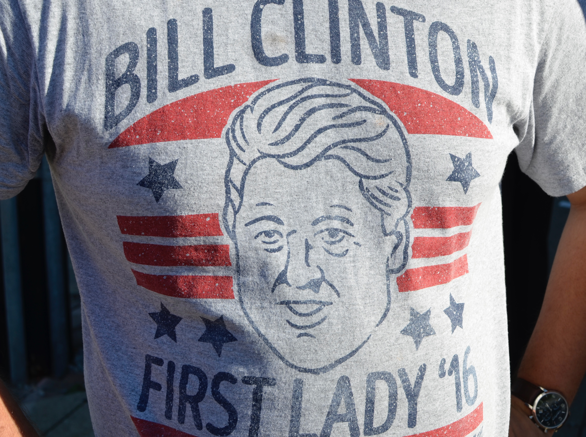

```{r setup, include=FALSE}
knitr::opts_chunk$set(echo = FALSE)
```

Despite many unforced errors Hillary Clinton has won the Democratic nomination and polls suggest she will beat Donald Trump. But her campaign continues to make unforced errors. There was plenty of evidence of an amateur nature to what should be a professional campaign at a recent rally for Clinton's running mate, Tim Kaine, in Grand Rapids, Michigan.

```{r}

```

The wait for Tim Kaine was around three hours. That's not unusual. But it meant the campaign had three hours in which no one was able to walk away or claim they had somewhere else to be. They had three hours to turn supporters into advocates. They blew it.

We wrote our contact details on a piece of paper while we waited in line. Presumably a volunteer's time was later spent transferring the scrawls into a computer. Why not have us enter our contact details ourselves into a tablet? It's the work of just a few hours to make an app to do that.

Local campaign volunteers spent a lot of time leading chants while we waited in line. Americans seem to like this, and enthusiasm is important - but it should be captured and used in ways that get more votes. Everyone that I talked to was going to vote for Clinton, but what about their friends, families and neighbors? Many in the line complained that there was no easy way to volunteer. They were so fired up against Trump that they wanted to do something right away. Why did the Clinton campaign not capture this enthusiasm by using the time spent in the line to organize? It would have been easy to get those supporters to commit to doorknock their neighborhood.

```{r}

```

To actually get into the event you had to hand-over the piece of paper with your contact details. Why did the campaign not send an SMS or email that could be shown to gain entry, thereby checking that the information was accurate? Even better, the local campaign could have made an organizing app, had people download it and then sent an entrance ticket using that. Sure, some people don't carry phones or aren't comfortable with technology, but it's easy enough to use pens and paper for them.

Finally, there no merchandise sales at the door. T-shirts are an easy source of \$10 - \$20 per person, and buttons an easy source of \$5. With about 500 people at the event, local campaigns could have easily raised at least a few thousand dollars.

```{r}

```

Clinton admits that she is not a good retail politician. And that's fine. It may make it more difficult to get elected, but in many ways it could be an advantage when it comes to actually being president. However, the Clinton campaign didn't seem able to even do the basic task that wins elections - organizing supporters to talk to their friends, family and others in their community.

Trump is an extraordinary factor pushing supporters toward Clinton. But her campaign needs to establish a network of committed supporters that it can lean on in 2020 when she will ask for a fourth Democratic term. Clinton has made many unforced errors and gotten away with it. But there is no good reason that her campaign should not be better at organizing. Although it looks as though she will beat Trump, she's risking 2020 if her campaign doesn't stop making these sorts of basic errors.

```{r}

```


