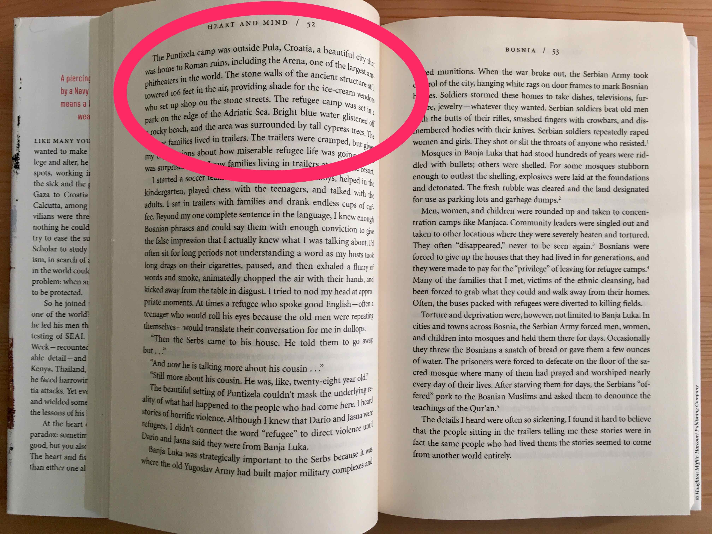

```{r setup, include=FALSE}
knitr::opts_chunk$set(echo = FALSE)
```

**(Comment 27 March 2019. This has aged horribly! Not only was it written with a presumption that Clinton was going to win, but even though Greitens won he flamed out within 18 months having been accused of some very odd behaviour. Nonetheless, the visit to Missouri was fun, and I enjoyed putting this piece together.)**

Eric Greitens may be the Republican Übermensch. Rhodes Scholar, Navy SEAL officer, husband and father. He's now the Republican candidate in the Missouri gubernatorial election. And one suspects that being a governor could just be a step for Greitens. While 2016 will always be the year that US politics descended to the gutter, it could also be the year that the next Republican president begins his political career.

```{r}
knitr::include_graphics("images/StLouis_Greitens_1.jpg")
```

It is easy to imagine Eric Greitens as a senior at Duke University as he entered the boxing ring for his Golden Gloves bout. He may liked to have chewed on his mouth guard, and thrown a few jabs. But instead of touching gloves with an opponent to start a fight, Greitens entered the ring and was declared the winner. Greitens became the Golden Gloves Novice Champion without throwing a punch in anger -- an opponent didn't even show up.

In some ways, it's unfair to mention this story. Greitens doesn't hide the fact that he won unopposed -- it was a key chapter in the memoir that acted as his political job application. But it is important to recognize how straightforward Greitens makes high achievement seem. It is easy to wonder if Greitens has ever felt close to failing.

```{r}
knitr::include_graphics("images/StLouis_Greitens_2.jpg")
```

At a recent rally of about 50 people in Des Peres on the outskirts of St Louis, Missouri, Greitens entered stage right. Greitens has lashed his political persona to his time as a Navy SEAL and styles himself as a 'conservative outsider'. He started off g-droppin' but then forgot himself and hints of his education could be heard. Greitens spoke like a head boy eager to impress -- no fillers such as 'um' or 'uh', with plenty of appropriate gestures, and useful timing and cadence changes.

He's still a little too polished to pull off George W. Bush's everyman. He's not yet comfortable enough in the weeds to give speeches about complicated ideas like Bill Clinton. And Greitens is not yet Obama in terms of ability to inspire. But Greitens is much better than many politicians at this stage of their career. It is important to recognize that events like this are the extent of many aspiring politician’s careers. And if he loses this race, Greitens surely has a plan for a political career that will be anything but average. Nonetheless, from his stump speech it is clear that if elected Greitens would like to be evaluated on jobs and education.

```{r}

```

If you had to balance the US population like a plate based on where people live then the center would lie in Missouri. It is also in the middle of many measures of jobs and education, such as the unemployment rate and the percentage of the population with at least a high school education. Between 1904 and 2004 whichever candidate won Missouri also won the overall election with the exception of 1956. But, in 2008 and 2012 the state voted Republican even though Obama won overall.

Economically, Missouri did not have many of the financial sector jobs that were directly affected by the financial crisis of 2007-08. Nonetheless the state was hit hard. According to data from the St Louis Federal Reserve in May 2007 Missouri's unemployment rate was 5.0 per cent, while the US unemployment rate was 4.4 per cent. A little over two years later, in December 2009, Missouri's unemployment rate had reached 9.8 per cent while that of the broader US economy was 9.9 per cent. Since that time, Missouri's unemployment rate reduced to 4.2 per cent in February 2016. But in contrast to the broader US economy during the past six months it has crept up. The September 2016 measure puts Missouri's unemployment rate at 5.2 per cent, while that of the broader US economy was 4.9 per cent.

Greitens didn't mention many specific economic plans, but as it is only a few hours south of Chicago the location of St Louis, Missouri's second-largest city, brings many economic opportunities. For instance St Louis could piggyback on the large number of tech firms that are starting in Chicago. If he wins, Greitens could convert some of the old St Louis warehouses into tech-friendly offices and offer any business coming out of a Chicago incubator subsidized rent if they, say, take on at least one intern from a Missouri college. Sure, most of the businesses will not survive, but those that will may stay in St Louis if, as Governor, Greitens ensures they plant roots.

On education Greitens gave the Republican rank-and-file what they wanted. The only point of agreement among warring Republican factions this presidential cycle seems to be an agreement that Common Core is terrible. It is worth remembering that Common Core is essentially just a set of education standards established by the federal government, but with considerable implementation leeway at a state level. Nonetheless Republicans from Jeb Bush to Donald Trump oppose it, and so does Greitens. Greitens also brings unions into the education debate, insisting that teachers should not be forced to join a union as a condition of employment.

While neither of these issues are likely to really help Missouri improve its educational outcomes, they do suggest that Greitens has at least some understanding of the importance of give-and-take in politics. And there are measures, such as increased support for vocational training and improved teacher training and support that he could easily tweak if he wins.

Given Missouri's circumstances there is plenty of opportunity for improvement and Greitens isn't short on ambition. Reading his first book, 'The Heart and the Fist', published in 2011, makes it clear that running for office has always been his plan. And the website 'ericgreitensforpresident.com' was registered at least as early as 21 July 2009, so it's clear what his goal is. Greitens makes life-defining achievements seem easy, but the swiftboating of John Kerry in 2004 showed how easy it can be to muddy a political opponent.

Greitens has already picked up a couple of bad habits. At the rally he referenced his humanitarian work in Kosovo. But in his memoir, the humanitarian work is described as happening in Croatia. While there are undoubtedly nuances due to historical and cultural factors that make the issue complicated, it is also the case that the largest population of Kosovars outside of the country lives in St Louis. This difference has already been [noted](http://www.stltoday.com/news/local/govt-and-politics/governor-nominee-s-work-in-bosnia-was-mainly-in-croatia/article_a9a6ae61-69e6-50b3-b142-5a4e74f12ec5.html) by at least one local newspaper and while it's not damning, Greitens should be more careful.

```{r}

```

Greitens also seems to have an unexpected aversion to openness, such as not releasing his tax returns. This is odd given that for so much of his life his primary income would likely have come from the Navy and then a non-profit that he founded. He'd have some income from public speaking fees, but it's hard to see why these would be embarrassing.

There's also a lot that needs to be improved in his campaign. For instance, there was no staffer at the door to the rally gathering the contact details of attendees. And there were no merchandise sales either at the rally or on Greitens' campaign website.

```{r}
knitr::include_graphics("images/StLouis_Greitens_6.jpg")
```

Whether he wins or loses the Missouri gubernatorial race on November 8, this won't be last we hear of Eric Greitens. In four years, he could run again for Governor or even against the Democratic Senator from Missouri, Claire McCaskill. The Republican 2020 cohort is firming with Senator Tom Cotton, Speaker Paul Ryan, and Governors John Kasich and Mike Pence already positioning themselves.

Greitens is not perfect. But those who serve in the military are among the best of us. And Rhodes Scholars are among the cleverest. His success as a politician will be worth watching.
