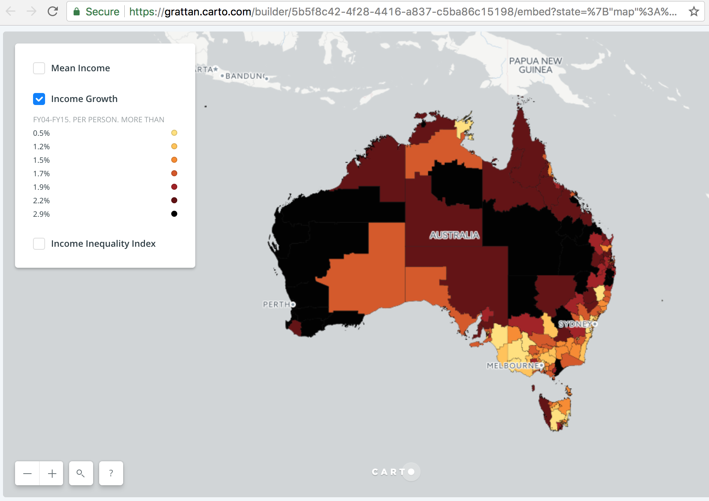
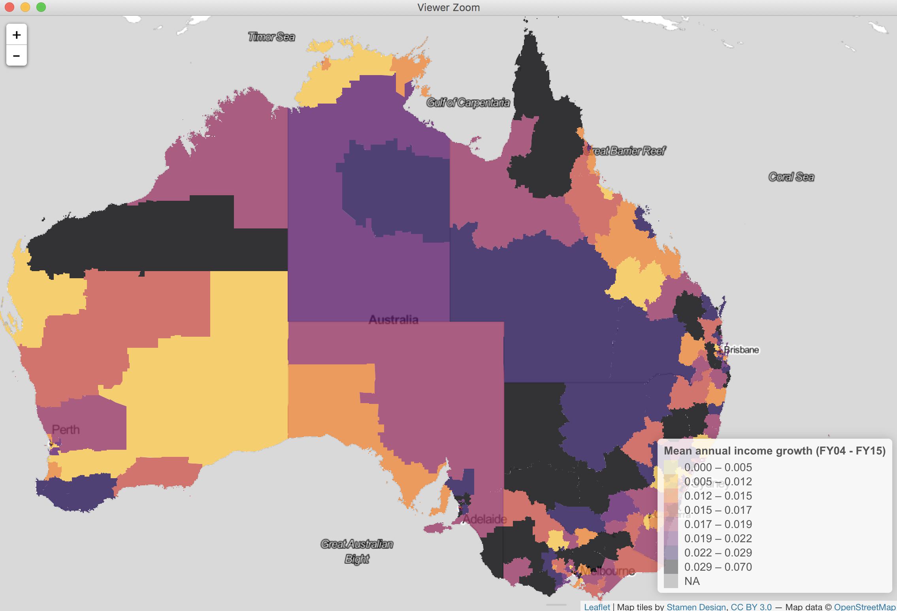

```{r setup, include=FALSE}
knitr::opts_chunk$set(echo = TRUE)

library(knitr)
```


*Thank you to Monica for her helpful edits.*

*Geoffrey Liu found an error in how I deal with the postcodes data that I haven't fixed yet.*

# Introduction
The Grattan Institute is an Australian think tank that produces reports about public policy. Last week they released ['Regional patterns of Australia's economy and population'](https://grattan.edu.au/report/regional-patterns-of-australias-economy-and-population/). That report looks into the differences between geographic areas across various economic and demographic variables. It includes interactive maps made using Carto. The Grattan Institute also released the datasets that underpin the report's maps and graphs.

I was interested to see if I could reproduce one of their interactive maps - [Annual income growth per person (FY04 - FY15)](https://grattan.carto.com/me) - in an hour using R and the Leaflet package. A day later I found the underlying dataset did not correspond with the map that the Grattan Institute published. But following the methodology in the report I was able to create a dataset that seems pretty close to the values illustrated on their map.

The final map that I produced is below (it'll take about 5 seconds to load) and this note records what I did to produce it in R using the Leaflet package.

```{r, echo=FALSE}
knitr::include_app("https://rohanalexander.shinyapps.io/grattan/", 
  height = "600px")
```


# Workspace
The first step was to set-up the workspace. Mostly this just meant loading packages. The <tt>tidyverse</tt> and <tt>magrittr</tt> packages help with general data manipulation tasks; <tt>zoo</tt> helps with the rolling average needed later; and <tt>leaflet</tt>, <tt>rgdal</tt>, and <tt>rmapshaper</tt> are specific to mapping.

```{r, eval=FALSE, echo=TRUE}
library(tidyverse)
library(magrittr)
library(zoo)
library(leaflet)
library(rgdal)
library(rmapshaper)
```


# Data
I decided to reproduce Figure 2.4 of the report. This shows the average annual growth in real taxable income per tax filer between the financial years 2003/04 and 2014/15 for the 2011 SA3 areas. To do this I needed the incomes data that the Grattan Institute mapped and the geographic data that defines the areas.

## Incomes
The Grattan Institute released the datasets that they said had been mapped. It was straightforward to download this file and export the relevant sheet as a csv file. The Excel file is available at https://grattan.edu.au/report/regional-patterns-of-australias-economy-and-population/ (in the left panel).

```{r, eval=FALSE, echo=TRUE}
# Import the income data that has been taken from the Grattan data download, sheet 'Figure 2.4' (which was saved as a csv).
incomes <- read_csv("data/890-Regional-patterns-chart-data.csv")
# Remove some debris columns
incomes <- incomes %>%
  select("SA3", "Growth_mean_income_FY04_FY15")
```

## Geographies
The other dataset that I needed was the geographies that the Grattan Institute had used. I initially wasted a lot of time using the 2016 SA3 release. Eventually I realised they were using the SA3 release from 2011. This is available from the ABS website at: http://www.abs.gov.au/AUSSTATS/abs@.nsf/DetailsPage/1270.0.55.001July%202011?OpenDocument and I used the zipped file: 'Statistical Area Level 3 (SA3) ASGS Ed 2011 Digital Boundaries in ESRI Shapefile Format'.

```{r, eval=FALSE, echo=TRUE}
# 2011 SA3 boundaries
old_boundaries <- readOGR(dsn = "data/1270055001_sa3_2011_aust_shape", layer = "SA3_2011_AUST")
# Add the income data into the boundaries dataset
old_boundaries <- merge(old_boundaries, incomes, by.x = "SA3_NAME11", by.y = "SA3")
```

Comparing the incomes data with the 2011 geographies data indicates the incomes data is missing two SA3 areas: 'Illawarra Catchment Reserve' and 'Blue Mountains - South'. I also found these areas had been left as NA in the Grattan Institute's interactive map. This made me confident that the Grattan Institute was using the 2011 boundaries (I may have missed it but I don't think this was documented).


# Map
Making the map was not complicated once the pieces were in place. I called Leaflet and specified a black and white base map. After that I adjusted the default view and then added the patchwork quilt that shows the incomes dataset by SA3 area. 

I didn't spend too much time on the colours because the inferno palette got fairly close. I just copied their published bins to reproduce the breaks that the Grattan Institute used. Box 1 in Appendix A of the Grattan Institute's report specifies how they came up with these bins. Give my purposes I didn't worry too much about this.

```{r, eval=FALSE, echo=TRUE}
# Set the color scheme 
pal <- colorBin(
  palette = "inferno",
  domain = old_boundaries$Growth_mean_income_FY04_FY15,
  bins = c(0, 0.005, 0.012, 0.015, 0.017, 0.019, 0.022, 0.029, 0.07),
  reverse = TRUE
  )

# Make the map
Australia_incomes_map <- 
  leaflet() %>%
  # Base map
  addProviderTiles(providers$Stamen.TonerLite, group = "Toner Lite") %>% 
  setView(lng = 133.7751, lat = -25.2744, zoom = 4) %>% # Specify where the map is initially focused
  addPolygons(data = old_boundaries, 
              color = pal(old_boundaries$Growth_mean_income_FY04_FY15), 
              weight = 1, 
              stroke = FALSE,
              smoothFactor = 0.5,
              fillOpacity = 0.8, 
              label = paste("Area name (SA3):", as.character(old_boundaries$SA3_NAME11), 
                            "Mean annual growth:", as.character(old_boundaries$Growth_mean_income_FY04_FY15)),
              highlightOptions = highlightOptions(color = "#666", weight = 2, bringToFront = FALSE)) %>% 
  addLegend("bottomright", pal = pal, values = old_boundaries$Growth_mean_income_FY04_FY15,
            title = "Mean annual income growth (FY04 - FY15)",
            opacity = 0.4
  )

# Call the map
Australia_incomes_map
```

There were many small changes that could be made to better reproduce the Grattan Institute's map, but at this stage I realised there was something going on with the data. I decided to spend more time with that than tweaking the remaining aspects.

# Comparison 
## Issues
Comparing screenshots of the maps shows some of the issues:

```{r fig.cap="Grattan's map", echo=FALSE}

```

```{r fig.cap="My map", echo=FALSE}

```

For instance there are areas where my map has a lot more variation such as:

* the northern SA3 areas of Queensland; and
* the SA3 areas in the south west of Western Australia.

And there are also some areas where the colours are fairly different (notwithstanding the fact that I didn't match theirs exactly), such as:

* west of Melbourne where my values are a lot higher.

## Triage
I checked that I was using the dataset that I had meant to use. While I was checking this dataset (which is the one that the Grattan Institute makes available) I noticed that the numbers in the Grattan Institute's dataset were not always the ones that were being mapped. This was easy to see because they included a static version of the map next to the dataset, so I was confident it was meant to be the same. 

I couldn't work out how to download the actual dataset underlying the interactive Carto map. But I was able to check some on an area-by-area basis because the value was displayed on mouse-hover. I found that the figure that was displayed did line up with the colour of the area, but not the dataset that they offered as underpinning the map.

The following table summarises some of the SA3 areas in north Queensland. 

SA3 Area  | Grattan Carto value | Grattan data value
------------- | ------------- | -------------
Cairns - South  | 1.73 | 2.0
Charters Towers - Ayr - Ingham  | 2.35 | 1.6
Far North   | 2.66 | 3.0
Outback - North  | 2.33 | 1.7
Port Douglas - Daintree  | 1.73 | 1.4
Tablelands (East) - Kuranda  | 2.23 | 1.6

The key issue was whether it was the Carto map or the dataset that was wrong.

# Down the rabbit hole
By this stage it was after dinner, and I'd had a glass or three of wine. But the only way to work out whether it was the dataset or the map that was wrong was to recreate the dataset myself. To do this I needed: 

* incomes data for financial years 2003-04 and 2014-15;
* an inflation rate over this time to make the 2003-04 data real; and
* a correspondence from postcodes to the 2011 SA3 areas.

Without their code it would be hard to be certain, but the Grattan Institute provided enough information in the report that I was confident I could get reasonably close to what they'd done.

## Incomes
The incomes data is from Table 8 of the ATO's 2015 tax stats which is available here:
https://data.gov.au/dataset/taxation-statistics-2014-15/resource/02e58971-ddee-4f77-af15-5c45de569ed6

```{r, eval=FALSE, echo=TRUE}
# Import the tax data
tax_data <- read_csv("data/taxstats2015individual08medianaveragetaxableincomestateterritorypostcode.csv", skip = 2, col_names = FALSE)
# Remove the debris rows
tax_data <- tax_data[2:2254,]
# Grattan says we only need postcode, the 2003/04 data and the 2014/15 data, so drop the rest of the variables
tax_data <- tax_data %>%
  select(X2:X5, X11:X13)
# Fix the column names
tax_data <- rename(tax_data, "postcode" = X2, "population_0304" = X3, "median_inc_0304" = X4, "ave_inc_0304" = X5, "population_1415" = X11, "median_inc_1415" = X12, "ave_inc_1415" = X13)
# Finally, change the classes to numeric (need to remove the comma first)
tax_data$population_0304 <- sub(",", "", tax_data$population_0304)
tax_data$median_inc_0304 <- sub(",", "", tax_data$median_inc_0304)
tax_data$ave_inc_0304 <- sub(",", "", tax_data$ave_inc_0304)
tax_data$population_1415 <- sub(",", "", tax_data$population_1415)
tax_data$median_inc_1415 <- sub(",", "", tax_data$median_inc_1415)
tax_data$ave_inc_1415 <- sub(",", "", tax_data$ave_inc_1415)
tax_data$postcode <- as.numeric(tax_data$postcode)
tax_data$population_0304 <- as.numeric(tax_data$population_0304)
tax_data$median_inc_0304 <- as.numeric(tax_data$median_inc_0304)
tax_data$ave_inc_0304 <- as.numeric(tax_data$ave_inc_0304)
tax_data$population_1415 <- as.numeric(tax_data$population_1415)
tax_data$median_inc_1415 <- as.numeric(tax_data$median_inc_1415)
tax_data$ave_inc_1415 <- as.numeric(tax_data$ave_inc_1415)
```

## Inflation
I needed to change the financial year 2003-04 incomes into 2014-15 dollars. In the Grattan Institute's report (p. 34) they say:

> Nominal income for the 2003-04 financial year was adjusted to real
2014-15 dollars, using a yearly average of ABS quarterly data on the
Consumer Price Index, starting from the 2003 September quarter.

I downloaded the inflation data that they specified from:
http://www.abs.gov.au/AUSSTATS/abs@.nsf/DetailsPage/6401.0Mar%202017?OpenDocument
(it is Series A2325846C which is in Tables 1 and 2 of the release). I wasn't exactly sure how the Grattan Institute constructed its measure, but I decided to just go with the RBA formula (http://www.rba.gov.au/calculator/) which is: (Average of the four quarters in the final year / average of the four quarters in the first year - 1) *100, although I didn't need to worry about removing one or the multiplying. 

```{r, eval=FALSE, echo=TRUE}
# Import the inflation data
inflation_data <- read_csv("data/640101.csv", skip = 10, col_names = FALSE)
# Grab the series they use: A2325846C
inflation_data <- inflation_data %>%
  select(X1, X10)
# Fix the column names
inflation_data <- rename(inflation_data, 
                   "quarter" = X1,
                   "index_value" = X10
)
# To use the RBA formula we need the average index number over the four quarters
inflation_data <- inflation_data %>%
  mutate(
    average_index_over_year = rollmean(index_value, 4, align = 'right', fill = NA)
  )
# Now we just use (final_year_ave / first_year_ave) (don't need to bother with removing the 1 or multiplying by 100 because we are just going to multiply the first year data up to get in terms of final year)
inflation_rate <- 
  ((inflation_data$average_index_over_year[inflation_data$quarter == "Jun-2015"] / inflation_data$average_index_over_year[inflation_data$quarter == "Jun-2004"]))
```

The inflation adjustment turned out to be about 1.34. I also worked out the annual inflation rates and then chained them, and also tried just using the start and end quarter index numbers (not averaged). They came to similar values, so even though I wasn't exactly sure what the Grattan Institute had done, I was confident that small differences wouldn't matter too much.

## Growth
I then needed to create the annual growth rate that the Grattan Institute used (p. 34):

> Growth in taxable income is calculated as a compound annual growth
rate from the 2003-04 financial year to the 2014-15 financial year.

```{r, eval=FALSE, echo=TRUE}
## Data manipulation - create the new interest variable that is of interest - 11 years?
tax_data <- tax_data %>%
  mutate(
    real_ave_inc_0304 = ave_inc_0304 * inflation_rate,
    real_median_inc_0304 = median_inc_0304 * inflation_rate,
    annual_ave_growth = (ave_inc_1415/real_ave_inc_0304)^(1/11),
    annual_median_growth = (median_inc_1415/real_median_inc_0304)^(1/11)
  )
```


## Correspondence
The incomes data that the ATO makes available is on a postcode basis. I needed to convert this into 2011 SA3 levels and the ABS makes a correspondence for this purpose. This is available at: http://www.abs.gov.au/AUSSTATS/abs@.nsf/DetailsPage/1270.0.55.006July%202011?OpenDocument where the correct table is the zipped file 'Postcode 2011 to Statistical Area Level 3 2011'.

```{r, eval=FALSE, echo=TRUE}
# Import the correspondence
correspondence <- read_csv("data/1270055006_CG_POSTCODE_2011_SA3_2011.csv", skip = 7, col_names = FALSE)
correspondence <- correspondence %>%
  select(X2:X6)
# Fix the column names
correspondence <- rename(correspondence, 
                   "postcode" = X2,
                   "SA3_CODE_2011" = X3,
                   "SA3_NAME_2011" = X4,
                   "ratio" = X5,
                   "percentage" = X6
)

correspondence <- merge(correspondence, tax_data, by.x = "postcode", by.y = "postcode")
match

correspondence <- correspondence %>%
  mutate(
    contribution_ave = ratio * annual_ave_growth,
    contribution_median = ratio * annual_median_growth
  )

sa3_data <- correspondence %>%
  group_by(SA3_NAME_2011) %>%
  summarise(
    ave_growth = weighted.mean(annual_ave_growth, ratio, na.rm = T),
    median_growth = weighted.mean(annual_median_growth, ratio, na.rm = T)
  )
```

## Putting it all together
This result of all this is that I created a dataset that seems pretty much the same as the one that the Grattan Institute mapped, but not the one that they released.

```{r, eval=TRUE, echo=TRUE}
#load("sa3_data.Rda")
#head(sa3_data, n = 20)
```

My dataset can be downloaded as a csv here: https://github.com/RohanAlexander/blogdown_website/blob/master/content/post/sa3_data.csv

The values underlying the Grattan Carto map and the values that I generated are the same for the five 2011 SA3 areas in the earlier table:

SA3 Area  | Grattan Carto value | Grattan data value | My value
------------- | ------------- | ------------- | -------------
Cairns - South  | 1.73 | 2.0 | 1.73
Charters Towers - Ayr - Ingham  | 2.35 | 1.6 | 2.35
Far North   | 2.66 | 3.0 | 2.66
Outback - North  | 2.33 | 1.7 | 2.33
Port Douglas - Daintree  | 1.73 | 1.4 | 1.73
Tablelands (East) - Kuranda  | 2.23 | 1.6 | 2.23

After having compared my values with theirs I think that in their Excel dataset the Grattan Institute ordered the columns for the SA3 areas and the incomes data separately instead of together.

## Reconciliation
I've reached out to the Grattan Institute and will update this post based on what they say.


# Conclusion
The Grattan Institute is probably Australia's most important think tank in terms of not being overly associated with one side of politics but still making a contribution to thinking on policy. It is good that they are being more open about their datasets, but it would be much better if they made their code available. Using tools like Leaflet and ggmap instead of Carto would help with this.

It was fun to spend the day in the data-analyst's version of a treasure chase. But hopefully the next time I decide to reproduce a Grattan Institute map common sense prevails before I go too far down the rabbit hole.


*Disclosures: In the interest of transparency I'll point out that I applied unsuccessfully for a job at the Grattan Institute about five years ago. One friend works as a research assistant for them on a casual basis; and there are a few friends-of-friends who work there full time, but I haven't talked about this post with any of them.*
