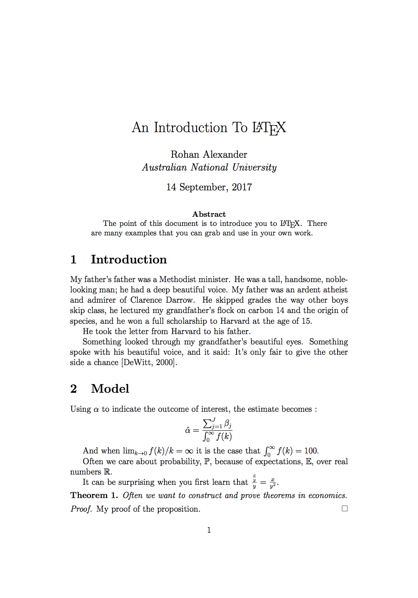

*Thank you to Janet Bradly and Maria Racionero for their support of this workshop. These notes are based on ones prepared by Zac Cranko and I for a presentation in 2015 and those that I put together for a 2016 presentation. Zac's work is used with permission.*

# Introduction
LaTeX makes it easier to produce papers that look great, but it can be overwhelming at the start. These notes help you get up-and-running with LaTeX. 

By the end you will have created an example paper and slides that include a title, author, affiliation, abstract, sections, tables, figures and references that looks like this:

```{r}

```

It is best to type everything out yourself, but you can download the tex file from here: https://github.com/RohanAlexander/blogdown_website/blob/master/static/img/paper.tex


# Writing papers
## Hello world!
You can treat LaTeX as a markup language. You mark your text with commands depending on how you want it to look, and then compile it to produce an output such as a PDF. Get started by downloading LaTeX, for free, from: https://www.latex-project.org/get/.

Use the default settings. You will likely end up installing a bunch of programs. (There is now a smaller version of MacTeX available, but for now it is probably best to stick with the original version for now.)

Let's make a document. Open 'TeXShop' if you're using a Mac, and 'TeXStudio' if you're using a PC.

In TeXShop/TeXStudio type:

```{css include = TRUE, eval = FALSE}
\documentclass{article}
\begin{document}
Hello world!
\end{document}
```

Then click 'Typeset'. A bunch of miscellaneous files are produced in the process of compiling. Don't worry about these -- all they do is make your directory ugly. The two important files are the tex file, which contains your markup, and the pdf file, which contains your output.

Square brackets are optional in LaTeX, but it is worth specifying the paper size and the font for the <tt>documentclass</tt> command. If you wanted to specify A4 paper and 12pt text by default then our 'Hello world!' becomes:

```{css include = TRUE, eval = FALSE}
\documentclass[a4paper, 12pt]{article}
\begin{document}
Hello world!
\end{document}
```

The type of document that you want goes in the braces. We used 'article', which is good for producing papers. There are many classes of document, including 'book', 'letter', and 'beamer' which is for presentations, but 'article' is probably the one that you will most commonly use.

## Packages 
Packages expand the basics of LaTeX. There are a few that you should load every time because they're often used when writing economics papers:

* amsmath; 
* amsthm; 
* amssymb; and
* graphicx.

Load these packages by adding the following after <tt>documentclass[a4paper, 12pt]{article}</tt>, but before <tt>begin document</tt>:

```{css include = TRUE, eval = FALSE}
\usepackage{amsmath, amsthm, amssymb, graphicx}
```

Then click 'Typeset'. Nothing should change in the output, we are just typesetting it to make sure that we have not introduced an error. The first three packages help when writing maths. The fourth helps with including graphs.

Everything before <tt>begin document</tt> is called the preamble, and everything after it is called the content.


## Title, author, and affiliation
You can add a title, author and affiliation to your paper by adding the following to the content:

```{r include = TRUE, eval = FALSE}
\title{An Introduction To \LaTeX}
\author{Rohan Alexander}
\date{14 September 2017}
\maketitle
```

Click 'Typeset' and a title should be added to your paper.

Add an affiliation by changing the <tt>author</tt> markup to:

```{r include = TRUE, eval = FALSE}
\author{Rohan Alexander\\
\textit{Australian National University}}
```

The <tt>textit</tt> command makes the text italic. You don't need to make the affiliation italic, but many people seem to. You could make your text bold using <tt>textbf</tt>.

Finally, add an acknowledgements section by changing the <tt>author</tt> markup to:

```{css include = TRUE, eval = FALSE}
\author{Rohan Alexander\thanks{Thank you to my primary supervisor, John Tang. All correspondence to rohan.alexander@anu.edu.au.}\\
\textit{Australian National University}}
```

If you don't include <tt>date{A specific date}</tt> then LaTeX will add today's date. If you don't want the date then add <tt>date{}</tt> instead. 


## Abstract
If you want an abstract, then LaTeX will do the formatting for you if you use the abstract tags. Add this markup just below <tt>maketitle</tt>:

```{css include = TRUE, eval = FALSE}
\begin{abstract}
The point of this document is to introduce you to \LaTeX. There are many examples that you can grab and use in your own work.
\end{abstract}
```

To summarise what your tex file should look like to this point:

```{css include = TRUE, eval = FALSE}
\documentclass[a4paper, 12pt]{article}

\usepackage{amsmath, amsthm, amssymb, graphicx}

\begin{document}

\title{An Introduction To \LaTeX}
\author{Rohan Alexander\thanks{Thank you to my primary supervisor, John Tang. All correspondence to rohan.alexander@anu.edu.au.}\\
\textit{Australian National University}}
\date{14 September, 2017}
\maketitle

\begin{abstract}
The point of this document is to introduce you to \LaTeX. There are many examples that you can grab and use in your own work.
\end{abstract}

\end{document}
```


## Sections
The main section commands are:
<tt>section</tt>, <tt>subsection</tt>, and <tt>subsubsection</tt>. These produce headings of decreasing importance and are numbered automatically. That can be turned off using an asterisk, for instance: <tt>section*</tt>.

For now let's add numbered introduction, model, and data sections to our document by adding the following markup after the abstract:

```{css include = TRUE, eval = FALSE}
\section{Introduction}
\section{Model}
\section{Data}
```

## Maths
Now let's add some maths into the model section of our paper. Type the following under the model section:

```{css include = TRUE, eval = FALSE}
Using $\alpha$ to indicate the outcome of interest, the estimate becomes :
$$ \hat{\alpha} = \frac{\sum^J_{j=1}\beta_j}{\int^{\infty}_{0}f(k)} $$
```

When you compile your tex file you should get this equation:

$$ \hat{\alpha} = \frac{\sum^J_{j=1}\beta_j}{\int^{\infty}_{0}f(k)} $$

We will now go through the pieces of this.

### Greek, limits, infinity, and integrals
We invoked 'maths mode' by using double dollar signs. That put the maths that you write on its own line. If you wanted to have your maths content without breaking the line, such as $x = 5$, then just use single dollar signs.

Within maths mode you can get many greek letters by backslash followed by their name. The examples above were <tt>alpha</tt> and <tt>beta</tt>.

Limits, infinity and integrals are built into LaTeX math mode, and can be access with the command <tt>lim</tt>, <tt>infty</tt>, and <tt>int</tt>. You can use accents and underbars if you need to denote what the limit refers to or upper and lower bounds. For instance, add the following markup underneath the formula:

```{css include = TRUE, eval = FALSE}
And when $\lim_{k\rightarrow0}f(k)/k = \infty$ it is the case that $\int^{\infty}_{0}f(k) = 100$.
```

When you compile this it should looks like:

And when $\lim_{k\rightarrow0}f(k)/k = \infty$ it is the case that $\int^{\infty}_{0}f(k) = 100$.


### Probability, expectations, real numbers, integrals
The $\mathbb{P}$, $\mathbb{E}$, and $\mathbb{R}$ that you may be used to seeing to denote probability, expectation, and the real numbers are made by a call to mathbb within maths mode. For instance add the following to your paper:

```{r include = TRUE, eval = FALSE}
Often we care about probability, $\mathbb{P}$, because of expectations, $\mathbb{E}$, over real numbers $\mathbb{R}$.
```

When you compile it should look like this: 

Often we care about probability, $\mathbb{P}$, because of expectations, $\mathbb{E}$, over real numbers $\mathbb{R}$.

You can also make a call to mathcal, for instance in naming sets <tt>$\mathcal{A}$</tt>, <tt>$\mathcal{B}$</tt>, <tt>$\mathcal{C}$</tt> or for a nice Lagrangian <tt>$\mathcal{L}$</tt>.


### Fractions
Fractions are built into math mode using <tt>frac{}{}</tt> and you can nest them if you need to. For instance add the following to your paper:

```{css include = TRUE, eval = FALSE}
It can be surprising when you first learn that $\frac{\frac{x}{y}}{y} = \frac{x}{y^2}$.
```

This should compile to:

It can be surprising when you first learn that $\frac{\frac{x}{y}}{y} = \frac{x}{y^2}$.

Be careful when using brackets and fractions because sometimes the sizes need to be aligned. You can do it manually, but alternative specify left and right, for instance, compare with and without:

```{r include = TRUE, eval = FALSE}
$$\left(\frac{\frac{x}{y}}{y}\right) = (\frac{\frac{x}{y}}{y})$$.
```

which compiles to:

$$\left(\frac{\frac{x}{y}}{y}\right) = (\frac{\frac{x}{y}}{y})$$.


### Theorems, definitions and proofs
Theorems and proofs draw on the amsthm package that was loaded earlier. You need to declare the name that you'll use to refer to it in the preamble. After that you can call a theorem, proposition, description, whatever it was you defined, throughout the document.

First, add this to the preamble:

```{css include = TRUE, eval = FALSE}
\newtheorem{theorem}{Theorem}
```

Then add this to the content:

```{css include = TRUE, eval = FALSE}
\begin{theorem}
Often we want to construct and prove theorems in economics.
\end{theorem}
```

In this case, I defined a theorem and LaTeX will print Theorem when compiled You could add another for propositions, etc.

Proofs are similar, but don't need to be defined in the preamble:

```{r include = TRUE, eval = FALSE}
\begin{proof}
My proof of the proposition.
\end{proof}
```

Your tex file should now look like this:

```{css include = TRUE, eval = FALSE}
\documentclass[a4paper, 12pt]{article}

\usepackage{amsmath, amsthm, amssymb, graphicx}

\newtheorem{theorem}{Theorem}

\begin{document}

\title{An Introduction To \LaTeX}
\author{Rohan Alexander\thanks{Thank you to my primary supervisor, John Tang. All correspondence to rohan.alexander@anu.edu.au.}\\
\textit{Australian National University}}
\date{14 September, 2017}
\maketitle

\begin{abstract}
The point of this document is to introduce you to \LaTeX. There are many examples that you can grab and use in your own work.
\end{abstract}

\section{Introduction}

\section{Model}

Using $\alpha$ to indicate the outcome of interest, the estimate becomes :
$$ \hat{\alpha} = \frac{\sum^J_{j=1}\beta_j}{\int^{\infty}_{0}f(k)} $$

And when $\lim_{k\rightarrow0}f(k)/k = \infty$ it is the case that $\int^{\infty}_{0}f(k) = 100$.

Often we care about probability, $\mathbb{P}$, because of expectations, $\mathbb{E}$, over real numbers $\mathbb{R}$.

It can be surprising when you first learn that $\frac{\frac{x}{y}}{y} = \frac{x}{y^2}$.

\begin{theorem}
Often we want to construct and prove theorems in economics.
\end{theorem}
\begin{proof}
My proof of the proposition.
\end{proof}

\section{Data}

\end{document}
```

## Text
### Paragraphs
LaTeX was designed for maths, but it does text well too. To start a new paragraph, just leave a blank line in your editor, LaTeX will take care of spacing. For instance add the following to your introduction:

```{css include = TRUE, eval = FALSE}
My father's father was a Methodist minister. He was a tall, handsome, noble-looking man; he had a deep beautiful voice. My father was an ardent atheist and admirer of Clarence Darrow. He skipped grades the way other boys skip class, he lectured my grandfather's flock on carbon 14 and the origin of species, and he won a full scholarship to Harvard at the age of 15.

He took the letter from Harvard to his father.

Something looked through my grandfather's beautiful eyes. Something spoke with his beautiful voice, and it said: It's only fair to give the other side a chance.
```

There are a few aspects to be aware of:

* To get 'a quote', you need to use the key next to the '1' on your keyboard for the opening mark and then the normal quotation mark for the end mark.
* You can makes words italic using <tt>textit{some italic words}</tt>, or make them bold using <tt>textbf{some bold words}</tt>.
* Because the dollar sign is used to invoke maths mode, if you want to refer to prices, say $4, then you need to use a slash before the dollar sign. This is the same for the per cent symbol, %.

Some people prefer different formatting on the paragraphs. Although it can cause some issues, you can change this by adding to the preamble:

```{css include = TRUE, eval = FALSE}
\usepackage{parskip}
```

### Lists
There are two main types of lists: <tt>itemize</tt> and <tt>enumerate</tt>.

Add the following to your data section:

```{css include = TRUE, eval = FALSE}
Our datasets were downloaded from:
\begin{itemize}
\item the ABS; and
\item the RBA.
\end{itemize}

We had two priorities:
\begin{enumerate}
\item reproducibility; and
\item ease of use.
\end{enumerate}
```

### Tables
Tables are often annoying in LaTeX. Fortunately, many programs will automatically format their table outputs with LaTeX markup for your to copy-and-paste into your tex file, and there are websites that can help.

Simple tables are not a problem. For instance, add the following to your data section:

```{css include = TRUE, eval = FALSE}
\begin{tabular}{ l | c || r }
  \hline
  1 & 2 & 3 \\
  4 & 5 & 6 \\
  7 & 8 & 9 \\
  \hline  
\end{tabular}
```

But it gets complicated. If you commonly use tables then it is easier to get your statistics program to output tables that have been formatted for LaTeX, or use an online table generator, such as http://www.tablesgenerator.com/.

In R, there is a package 'Huxtable'.


### Graphs and pictures
To include graphs or pictures in your document, add the file to the same folder that your tex file is in. From there you can add it. Many adjustments are possible in terms of size and layout. Fortunately, all the labelling is done for us. For instance, download the following image into the folder where your tex file is saved: 
https://github.com/RohanAlexander/blogdown_website/blob/master/static/img/me.png

Then add this markup into your data section:

```{css include = TRUE, eval = FALSE}
\begin{figure}[h!]
\caption{My first image}
\center
\includegraphics[width=0.80\textwidth]{me.png}\label{australia_map}
\end{figure}

Income inequality in Australia is illustrated in Figure \ref{australia_map}.
```

Your tex file should look like this:

```{css include = TRUE, eval = FALSE}
\documentclass[a4paper, 12pt]{article}

\usepackage{amsmath, amsthm, amssymb, graphicx}

\newtheorem{theorem}{Theorem}


\begin{document}

\title{An Introduction To \LaTeX}
\author{Rohan Alexander\\
\textit{Australian National University}}
\date{14 September, 2017}
\maketitle


\begin{abstract}
The point of this document is to introduce you to \LaTeX. There are many examples that you can grab and use in your own work.
\end{abstract}


\section{Introduction}
My father's father was a Methodist minister. He was a tall, handsome, noble-looking man; he had a deep beautiful voice. My father was an ardent atheist and admirer of Clarence Darrow. He skipped grades the way other boys skip class, he lectured my grandfather's flock on carbon 14 and the origin of species, and he won a full scholarship to Harvard at the age of 15.

He took the letter from Harvard to his father.

Something looked through my grandfather's beautiful eyes. Something spoke with his beautiful voice, and it said: It's only fair to give the other side a chance.


\section{Model}
Using $\alpha$ to indicate the outcome of interest, the estimate becomes :
$$ \hat{\alpha} = \frac{\sum^J_{j=1}\beta_j}{\int^{\infty}_{0}f(k)} $$

And when $\lim_{k\rightarrow0}f(k)/k = \infty$ it is the case that $\int^{\infty}_{0}f(k) = 100$.

Often we care about probability, $\mathbb{P}$, because of expectations, $\mathbb{E}$, over real numbers $\mathbb{R}$.

It can be surprising when you first learn that $\frac{\frac{x}{y}}{y} = \frac{x}{y^2}$.

\begin{theorem}
Often we want to construct and prove theorems in economics.
\end{theorem}
\begin{proof}
My proof of the proposition.
\end{proof}


\section{Data}
Our datasets were downloaded from:
\begin{itemize}
\item the ABS; and
\item the RBA.
\end{itemize}

We had two priorities:
\begin{enumerate}
\item reproducibility; and
\item ease of use.
\end{enumerate}

\begin{tabular}{ l | c || r }
  \hline
  1 & 2 & 3 \\
  4 & 5 & 6 \\
  7 & 8 & 9 \\
  \hline  
\end{tabular}
  
\begin{figure}[h!]
\caption{My first image}
\center
\includegraphics[width=0.80\textwidth]{me.png}\label{australia_map}
\end{figure}

Income inequality in Australia is illustrated in Figure \ref{australia_map}.

\end{document}
```


## References
LaTeX uses Bibtex for references. To use this open a new file in TeXShop/TeXStudio and add the following:

```{css include = TRUE, eval = FALSE}
@Book{DeWitt2000,
    author = {Helen DeWitt},
    title = {The Last Samurai},
    publisher = {Hyperion Books},
    place = {United State of America},
    year = {2000},
  }
```

Save it as first_bibliography.bib in the same folder as your tex file. Then add the following at the end of the paragraphs in your Introduction:

```{css include = TRUE, eval = FALSE}
\cite{DeWitt2000}
```

And add the following at the end of your document, on the line above <tt>end{document}</tt>.

```{css include = TRUE, eval = FALSE}
\bibliography{first_bibliography}
```

Then typeset as BibTeX, (you'll only need to do this once each time you update your bib file), and then typeset as normal with LaTeX.

Your tex file should look like this:

```{css include = TRUE, eval = FALSE}
\documentclass[a4paper, 12pt]{article}

\usepackage{amsmath, amsthm, amssymb, graphicx}

\newtheorem{theorem}{Theorem}


\begin{document}

\title{An Introduction To \LaTeX}
\author{Rohan Alexander\\
\textit{Australian National University}}
\date{14 September, 2017}
\maketitle


\begin{abstract}
The point of this document is to introduce you to \LaTeX. There are many examples that you can grab and use in your own work.
\end{abstract}


\section{Introduction}
My father's father was a Methodist minister. He was a tall, handsome, noble-looking man; he had a deep beautiful voice. My father was an ardent atheist and admirer of Clarence Darrow. He skipped grades the way other boys skip class, he lectured my grandfather's flock on carbon 14 and the origin of species, and he won a full scholarship to Harvard at the age of 15.

He took the letter from Harvard to his father.

Something looked through my grandfather's beautiful eyes. Something spoke with his beautiful voice, and it said: It's only fair to give the other side a chance \cite{DeWitt2000}. 


\section{Model}
Using $\alpha$ to indicate the outcome of interest, the estimate becomes :
$$ \hat{\alpha} = \frac{\sum^J_{j=1}\beta_j}{\int^{\infty}_{0}f(k)} $$

And when $\lim_{k\rightarrow0}f(k)/k = \infty$ it is the case that $\int^{\infty}_{0}f(k) = 100$.

Often we care about probability, $\mathbb{P}$, because of expectations, $\mathbb{E}$, over real numbers $\mathbb{R}$.

It can be surprising when you first learn that $\frac{\frac{x}{y}}{y} = \frac{x}{y^2}$.

\begin{theorem}
Often we want to construct and prove theorems in economics.
\end{theorem}
\begin{proof}
My proof of the proposition.
\end{proof}


\section{Data}
Our datasets were downloaded from:
\begin{itemize}
\item the ABS; and
\item the RBA.
\end{itemize}

We had two priorities:
\begin{enumerate}
\item reproducibility; and
\item ease of use.
\end{enumerate}

\begin{tabular}{ l | c || r }
  \hline
  1 & 2 & 3 \\
  4 & 5 & 6 \\
  7 & 8 & 9 \\
  \hline  
\end{tabular}
  
\begin{figure}[h!]
\caption{My first image}
\center
\includegraphics[width=0.80\textwidth]{me.png}\label{australia_map}
\end{figure}

Income inequality in Australia is illustrated in Figure \ref{australia_map}.

\bibliographystyle{unsrt}
\bibliography{first_bibliography.bib}


\end{document}
```

# Slides
Making slides is similar to writing a paper in that the markup can be the same. But you need to specify when the content of a slide should start and stop and also what the title should be.

To get started, open a new file in TeXShop/TeXStudio and add the following:

```{css include = TRUE, eval = FALSE}
\documentclass{beamer}

\usepackage{amsmath, amsthm, amssymb, graphicx}

\begin{document}

\end{document}
```

You'll notice that the only difference is that the document class has been changed to beamer.

Copy the title, author and date, etc markup from your paper, and then paste it between <tt>begin{frame}</tt> and <tt>end{frame}</tt>. So your file should look like this:

```{css include = TRUE, eval = FALSE}
\documentclass{beamer}

\usepackage{amsmath, amsthm, amssymb, graphicx}

\begin{document}

\begin{frame}
\title{An Introduction To \LaTeX}
\author{Rohan Alexander\\
\textit{Australian National University}}
\date{14 September, 2017}
\maketitle
\end{frame}

\end{document}
```

When you save and compile this you should get slides.

You can add a content slide by adding the following after that first slide:

```{css include = TRUE, eval = FALSE}
\begin{frame}
\frametitle{Main results}
\begin{itemize}
\item I find that income inequality is increasing.
\item This is because of slower income growth in country areas.
\end{itemize}
\end{frame}
```

I've chosen to include a list, but you could include paragraphs, or images or tables using the same markup that you have in your paper.

# Misc
## Learning more and getting help
* Check that there is an <tt>end</tt> for every <tt>begin</tt>, and similarly that all braces that are opened are also closed.
* Compile frequently so that you have a better idea of where the error is.
* Stack Overflow is helpful if you want specific changes or features.
* The wikibooks guide - https://en.wikibooks.org/wiki/LaTeX - is an excellent resource to improve your knowledge.

## ShareLaTeX
These days I more commonly use LaTeX in the cloud instead of on my local computer, via: https://www.sharelatex.com/. The advantage is that it brings google-docs-style collaboration tools.

