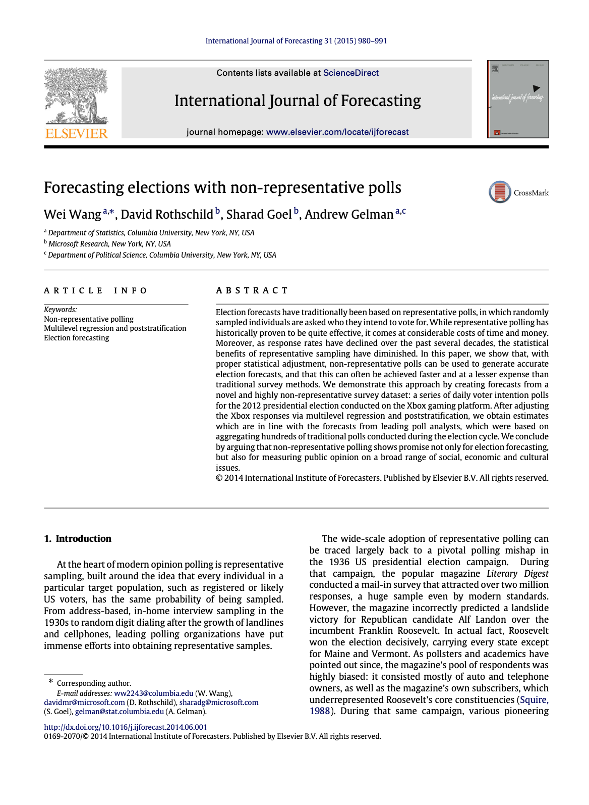

```{r setup, include=FALSE}
knitr::opts_chunk$set(echo = FALSE)
```

# Introduction

'Forecasting elections with non-representative polls' by [Wei Wang](https://www.linkedin.com/in/thomasweiwang/), [David Rothschild](https://researchdmr.com/), [Sharad Goel](https://5harad.com/), and [Andrew Gelman](http://www.stat.columbia.edu/~gelman/), published in 2015 in the *International Journal of Forecasting*, is a wonderful paper that should be more widely read, studied, and cited.^[This paper literally changed the course of my professional life. I read it in late 2015 when I was very bored by my economics PhD. I couldn't put it down. It seems silly now, but until then I didn't realise that statisticians wrote papers like this, and that not only could you bring together the best aspects of politics, surveys, quantitative analysis, etc but that you could also write academic papers about it! It was the combination of everything that I was interested in. Starting in early 2016 Monica Alexander and I followed this paper and Monica implemented a version of the model in JAGS for Australia, which become: [Petit Poll](petitpoll.com). We gathered our own polling data by emailing friends and family and used all of this to forecast the 2016 Australian election. (We forecast the Coalition would 80-85 seats, and they eventually won 76 seats - the electoral divisions of Bass, Braddon, Lyons, and Mayo haunt my dreams.) We went on to use MRP for various other projects, improving our understanding of it and related methods. Monica was already there, but I dove further into learning R, Bayesian statistics, and machine learning, focused on applications in political science, eventually also branching out into related techniques such as text analysis. Now almost all of my work is very much statistics applied to political science, but it all started with this paper.] It touches on many aspects from across social sciences and applied statistics, allowing readers from a variety of backgrounds a chance to better understand multi-level regression with post-stratification (MRP), and how they might contribute to its development or apply it in their own contexts. The paper clearly illustrates the power of MRP and motivates its use more widely, but is held back by not being reproducible and some unusual choices around datasets.

In the paper the authors use a non-representative sample of voting intention in the 2012 US presidential election from the Xbox platform, which enables people to play video games against each other online. They then combine this sample with data from exit polls, as well as a Bayesian hierarchical model, to provide estimates that are very similar to those produced from representative samples.

The key contributions of the paper include:

1. Showing how a 'non-traditional' dataset can still yield meaningful results.
2. Translating daily estimates of opinion into what actually determines the election: electoral college votes.
3. Illustrating the potential for MRP in other areas.

Key weaknesses of the paper include: 

1. a lack of reproducibility, and even a lack of transparency in some aspects;
2. a difficult-to-justify choice of dataset for post-stratification; 
3. a lack of clarity around the propagation of uncertainty; and
4. an inconsistent definition of what a good MRP model produces.

In the remainder of this review I will summarise the key aspects of the paper, attempting to link them to subsequent research where appropriate, and discussing the paper's strengths and weaknesses, as well as raising questions that are unresolved in my mind. Based on Google Scholar, as of 11 February 2020, the paper has 'only' been cited around 250 times. It deserves to be much more widely read as it is a straight-forward paper that clearly illustrates the power of MRP, without hiding the potential issues.


# Motivation

> The king (representative sampling) is dead, long live the king (non-representative sampling).

```{r, fig.cap="Wang, Rothschild, Goel, and Gelman, (2015), page 1."}

```

The paper begins with a detailed description of the role of representative sampling in modern opinion polling. It clearly illustrates why representative sampling become important, following the *Literary Digest* error during the 1936 US presidential election between Landon and Roosevelt. It does this with reference to two papers, both published in *Public Opinion Quarterly* albeit with a gap of more than 50 years, that are very interesting in their own right: Gosnell (1937) and Squire (1988) (Figure \@ref(fig:bothpapers)).

```{r bothpapers, layout="l-body-outset", echo=FALSE, fig.cap="Gosnell, 1937, on the left, and Squire, 1988 on the right."}
knitr::include_graphics("paper_both.png")
```

These first few paragraphs may prompt some readers to think about the role of representative sampling in their own areas. The authors clearly establish the paper as aimed at a general audience,^[One of the interesting aspects around this introduction and motivation section is that there is little discussion of the usual aspects that those who are already convinced of the MRP approach get excited about. Features such as the importance of probability distributions, and the appropriate role of uncertainty, which those of us who use MRP (and related approaches) day-to-day see as motivation, are of less concern to a broader audience. By carefully constructing the introduction and motivation section, the authors likely greatly increased the number of readers who continue through the rest of the paper.] rather than solely ~~Bayesian cult members~~, ~~quantitative absolutionists~~, ~~math wunderkinds^[The first use of mathematical notation does not occur until the end of the third page. This also likely helps boost the readership of this paper!]~~, ~~Stan stans^[I stole this name from Jack Bailey. FWIW Stan existed at this point, but had not taken off to the extent it would in the following few years.]~~ those who are already convinced of the power of MRP. The authors then give two reasons why the primacy of representative sampling may not now be absolute:

1. Non-response rates are increasing for a variety of reasons including a reluctance to answer phone surveys and increased screening. The effect is possible concern around selection, but even if this selection issue does not arise, lower response rates require more post-sampling adjustment.
2. Online surveys mean large, non-representative, samples are much cheaper to collect. 

On the basis of this the authors suggest MRP as an alternative and proceed to discuss their sample and their post-stratification dataset.


# Data

At a minimum MRP requires two datasets. The first is the sample that is of interest, and the second is a dataset by which to adjust for some of that sample's bias. This paper uses data from a biased, but large, sample of Xbox users about their voting intention in the 2012 US presidential election, and uses a poststratification dataset from exit polls.

### Survey data

Key facts about the survey data:

- Data from an opt-in poll which was available on the Xbox gaming platform during the 45 days preceding the 2012 US presidential election.
- Each day there were three to five questions, including voter intention: 'If the election were held today, who would you vote for?'.
- Respondents were allowed to answer at most once per day.
- First-time respondents were asked to provide information about themselves, including their sex, race, age, education, state, party ID, political ideology, and who they voted for in the 2008 presidential election. (That demographic data was collected before a respondent answered a poll to try to limit the amount of people switching their demographics to be in line with their intention, although it is difficult to adjust for the inverse, and increasingly respondents seem to be responding as pundits.)
- There were 750,148 responses, 345,858 unique respondents, and over 30,000 unique respondents who completed five or more polls.^[It doesn't really matter, but why was this number rounded, while the others are exact?] ^[The point was raised during discussion that it would have been interesting to know the number of those who changed their mind. My experience with Australian data (as well as talking to people who are much more experienced in this area than I am) suggests there would have been very few.] 

The dataset is highly skewed (Figure \@ref(fig:figone)):

- 18-to-29-year-olds comprise 65 per cent of the Xbox dataset, compared to 19 per cent in the exit poll.
- Men make up 93 per cent of the Xbox sample but only 47 per cent of the electorate. 

```{r figone, fig.cap="(This is Figure 1 in the paper) 'A comparison of the demographic, partisan, and 2008 vote distributions in the Xbox dataset and the 2012 electorate (as measured by adjusted exit polls). As one might expect, the sex and age distributions exhibit considerable differences.'"}
knitr::include_graphics("fig_1.png")
```

Age and sex are known to be strongly correlated with voting preferences, and this shows up in the raw data (Figure \@ref(fig:figtwo)).

```{r figtwo, fig.cap="(This is Figure 2 in the paper.) 'Daily (unadjusted) Xbox estimates of the two-party Obama support during the 45 days leading up to the 2012 presidential election, which suggest a landslide victory for Mitt Romney. The dotted blue line indicates a consensus average of traditional polls (the daily aggregated polling results from Pollster.com), the horizontal dashed line at 52% indicates the actual two-party vote share obtained by Barack Obama, and the vertical dotted lines give the dates of the three presidential debates.'"}

```


There are considerable changes over time, for instance a decrease in support for Obama after the first debate (Figure \@ref(fig:figtwo)).


### Post-stratification data

The survey is biased, but the question at the heart of MRP is whether it can be salvaged. 

In order to adjust for known bias in the sample we need a dataset that we would like our dataset to 'mimic'. This is done by constructing 'cells' which are defined by a combination of all of the variables (say economic, demographic, and geographic features). For instance if we were interested in explaining vote share on the basis of age-group and sex, then we would need to know the number of 18-29-year-old males, the numbers of 18-29-year-old females, the number of 30-45-year-old males, and so on. We then apply a model trained on the survey to these 'corrected' proportions. Hence each additional variable adds considerably to what is needed from the post-stratification dataset.^[Monica and I have submitted an application to present a paper about this topic at a [super fantastic MRP-fest being organised by Lauren Kennedy and held at Columbia in April 2020](https://jazzystats.com/mrp2020/). Hopefully our proposal is accepted!]

Once those cells are constructed, then the model trained on the sample is applied to each cell to generate an estimate for each cell. For instance, we might be interested in the proportion of 18-29-year-old males who would vote for Obama. Those cells can then be aggregated based on their relative-weight in the post-stratification dataset. For instance, if 18-29-year-old males make up 10 per cent of the population then their support for Obama would be weighted to 10 per cent.

This section of the paper is especially compelling. It draws on a variety of important issues including sampling and uncertainty, to motivate the use of a hierarchical model. The specific issue in the minds of many readers who may be new to MRP but are used to analysing surveys is that the above post-stratification process could be done with weights. This requires assuming that within each cell the sampling is un-biased. That implies a need for fine cells. But in practice especially fine cells are likely to have small populations, and so small differences will have large effects. Here we can think of the kidney cancer counties example where the clusters of the high and low countries tend to be right next to each other, because a handful of cases in a small area has a big effect. We can also think of [Monica Alexander's](https://www.monicaalexander.com/) shrinking California example (Figure \@ref(fig:figcali)).

```{r figcali, layout="l-body-outset", fig.cap="Effect of shrinking California on estimates of mortality by age."}

```

Hence, the need for a hierarchical model!^[The author's describe multi-level modelling as regularised regression. I'd be keen to explore this in a little more detail.] The authors mention a variety of MRP papers going back to 2004.^[We've seen in earlier papers in this reading group that we can see echoes (that's the wrong word; what's the antecedent of an echo?) in much earlier work including Fay and Herriot (1979) and Little (1993) and probably a bunch of other papers. The definitive MRP history paper is probably not yet written. Lauren - are you taking submissions for MRP-fest 2021 or maybe 2022?]

The authors use a large number of variables to generate the cells by:

- sex (2 categories);
- race (4 categories);
- age-group (4 categories);
- education (4 categories);
- state (51 categories); 
- party ID (3 categories); 
- ideology (3 categories); and 
- 2008 vote (3 categories).

As such they have $2\times4\times4\times4\times51\times3\times3\times3 = 176,256$ cells. O.M.G. The authors provide some justification for the inclusion of each of these variables, but there was scope for more given the importance of this aspect within an MRP analysis.^[Given how correlated and overlapping some of these variables seem (e.g. party ID, ideology, and 2008 vote), this discussion is not as extensive as I would like. As a reviewer of the paper, I would be interested in examining the performance of a 'cut down' version of the model. This would have also helped with some of the dataset issues raised later.] 

The Current Population Survey (CPS) is the usual go-to survey in the US in terms of post-stratification data. But the authors turn away from the CPS because 'the CPS is missing some key poststratification variables, such as party identification.'^[1. This seems like something that could have a big effect or at least needs a lot of justification. I would have liked to have seen much more justification of this. If I were a reviewer then I would have requested they run the model using CPS and throw away whatever variables that it doesn't have from their model. They only mention one variable, so I just can't see why it is worth taking the hit in being so unconventional. 
2. This decision also limits the capacity of others to reproduce the results. Anyone can get CPS data. But how do I get the exit poll data that they used? What exit polls did they even use? Did I miss this? The post-stratification dataset is kind of everything.] Instead they use exit poll data from the 2008 presidential election.

> Exit polls are conducted outside voting stations on election day, and record the choices of exiting voters; they are generally used by researchers and news media to analyze the demographic breakdown of the vote (after a post-election adjustment that aligns the weighted responses to the reported state-by-state election results).

The exit poll that they use is made up of 101,638 respondents.^[I couldn't work out which exit poll they used? I probably just missed a description of it, but even so, I also couldn't see that they provide the data, which would have really helped improve the reproducibility of the paper.] The authors describe how this disadvantages their analysis as they have to use data that is four years out of date (it wouldn't be appropriate to use 2012 exit polls to forecast the 2012 election!).^[However this would be another benefit of using the CPS dataset, as it is run monthly.] 


# Model

Given the nature of the US electorate, they use a nested modelling approach: the first models whether a respondent is likely to vote for one of Obama or Romney given various information such as state, education, sex, etc:^[Romney! Wow! Remember the good old days when it was the fact that the Republican candidate was going to go out of his way to appoint lots of women to positions of power was something that was held against him.]^[The point was raised during discussion that to a certain extent it's not clear why they bother with this two-level approach. How large could the number of non-major party voters be? In any case, it introduces a lot, and I'm not sure the trade-off is there.]
$$
Pr\left(Y_i\in\{\mbox{Obama, Romney}\}\right) =\\
\mbox{logit}^{-1}\left(\alpha_0 + \alpha_1(\mbox{state last vote share}) 
+ \\
\alpha_{j[i]}^{\mbox{state}} + \alpha_{j[i]}^{\mbox{edu}} + \alpha_{j[i]}^{\mbox{sex}} + \alpha_{j[i]}^{\mbox{age}}+ \alpha_{j[i]}^{\mbox{race}}+ \alpha_{j[i]}^{\mbox{party ID}}+\\ \alpha_{j[i]}^{\mbox{ideology}}+ \alpha_{j[i]}^{\mbox{last vote}}
\right)
$$

The priors on the coefficients for each variable - "var" - are given by independent distributions: $N(0, \sigma^2_{var})$^[Would the authors would still use these priors or has the state-of-the-art changed?] and the variance parameters are assigned a hyperprior distribution: $\sigma^2_{var}\sim \mbox{inv-}\chi^2(\nu,\sigma^2_0)$.^[Again, is this what we'd still do today?] 

Here, again, the authors go to some effort to 'sell' the MRP approach by making explicit the notion of sparse cells borrowing strength. The idea is that if some cell has very little information then it's coefficients will be drawn from an average of those cells that are similar.

After establishing whether a person is likely to vote for one of Obama or Romney, they use a very similar model to consider whether, given a person is voting for one of those two, a person is voting for Obama:
$$
Pr\left(Y_i = \mbox{Obama} | Y_i\in\{\mbox{Obama, Romney}\}\right) =\\
\mbox{logit}^{-1}\left(\alpha_0 + \alpha_1(\mbox{state last vote share}) 
+ \\
\alpha_{j[i]}^{\mbox{state}} + \alpha_{j[i]}^{\mbox{edu}} + \alpha_{j[i]}^{\mbox{sex}} + \alpha_{j[i]}^{\mbox{age}}+ \alpha_{j[i]}^{\mbox{race}}+ \alpha_{j[i]}^{\mbox{party ID}}+\\ \alpha_{j[i]}^{\mbox{ideology}}+ \alpha_{j[i]}^{\mbox{last vote}}
\right)
$$

All of this is run in R (R Core Team, 2019) using 'approximate marginal maximum likelihood estimates' via glmer() from the lme4 package (Bates, et al, 2015).^[Maybe I missed it but they don't provide their code. This was very annoying in 2016 when Monica and I were trying to make our own version of the model. But these days it really limits the paper. Other 'beginner-friendly' MRP papers, such as Kastellec et al., 2016, or Hanretty, 2019, include all of their code which make them easier to assign when teaching.] ^[What effect does using glmer() have on the results? I'm assuming these days this would be fit in Stan, but how easy would it be? What do we gain?] ^[It wasn't clear to me whether all of this can be run at once or do they need to run each separately? If the later, how is uncertainty being propagated between the two? Does it matter? I'm sure there are good answers here that I'm just not seeing, but I can't see it.] The estimate for each day is run on the basis of that day's results as well as the previous four, hence introducing a degree of smoothing.^[Best I can tell each of these rolling averages for a day is run independently. Why not bring it all together?]

After this model is trained it is applied to the post-stratification dataset.^[Somehow you need to bring both models to the table here, but I don't understand whether each model is applied separately in which case what is happening to the uncertainty, or if it is possible to somehow combine it all using lme4?] Estimates are made for each cell and then aggregated up to the population based on the weight of the proportion of the electorate in each cell.


# Results - Voter intention

### Overall results

Figure \@ref(fig:figthree) compares the MRP estimate (red line) with a pollster average (blue line). The vertical dotted lines are presidential debates, the horizontal dashed line is the actual outcome.

```{r figthree, layout="l-body-outset", fig.cap="(This is Figure 3 in the paper.) 'National MRP-adjusted voter intent of two-party Obama support over the 45-day period, with the associated 95% confidence bands. The horizontal dashed line indicates the actual two-party Obama vote share. The three vertical dotted lines indicate the presidential debates. Compared with the raw responses in Fig. 2, the MRP-adjusted voter intent is much more reasonable, and the voter intent in the last few days is close to the actual outcome. On the other hand, the daily aggregated polling results from Pollster.com, shown by the blue dotted line, are further away from the actual vote share than the estimates generated from the Xbox data in the last few days.'"}

```

With relation to Figure \@ref(fig:figthree), the authors argue:^[They show how close their results are to the actual outcome, but at the end acknowledge that this probably isn't the best way to evaluate MRP models and discuss other aspects. What does a 'meaningful result' mean in the context of MRP?]

> On the day before the election, our estimate of voter intent is off from the actual outcome (indicated by the dotted horizontal line) by a mere 0.6 percentage points.

### State-specific results

They then disaggregate the national-level vote share into states (Figure \@ref(fig:figfour)). This has important considerations for the issue of importance - electoral college results. This disaggregation illustrates an important feature of MRP - that state-specific estimates can be obtained by using a state-specific post-stratification dataset. The trained model remains the same, it is only the post-stratification that changes.

```{r figfour, layout="l-body-outset", fig.cap="(This is Figure 4 in the paper.) 'MRP-adjusted daily voter intent for the 12 states with the most electoral votes, and the associated 95% confidence bands. The horizontal dashed lines in each panel give the actual two-party Obama vote shares in that state. The mean and median absolute errors of the last day voter intent across the 51 Electoral College races are 2.5 and 1.8 percentage points, respectively. The state-by-state daily aggregated polling results from Pollster.com, given by the dotted blue lines, are broadly consistent with the estimates from the Xbox data.'"}

```

Figure \@ref(fig:figfour) illustrates the twelve states with the most electoral college votes. The authors argue that although there are similar trends between the states, there are state-specific movements, which speak to a blending of national and state-level signals. Again, the blue dotted line is a pollster average, the red dotted line is the MRP estimates, the horizontal dashed line is the eventual outcome, and the vertical dotted line is the debates.


### Demographic-specific results

Similarly, demographic-specific estimates can be estimated by re-weighting the post-stratification dataset. Figure \@ref(fig:figfive) illustrates some important demographic features.^[the point was raised during discussion that there should probably be some measure of uncertainty around these estimates.]

```{r figfive, layout="l-body-outset", fig.cap="(This is Figure 5 in the paper.) 'Comparison of the two-party Obama vote share for various demographic subgroups, as estimated from the 2012 national exit poll and from the Xbox data on the day before the election.'"}
knitr::include_graphics("fig_5.png")
```

Finally, the results can be compared with the actual results, say on the basis of the most-important two-dimensional demographic sub-groups (left-panel of Figure \@ref(fig:figsix)) or illustrating their size (right panel of Figure \@ref(fig:figsix)).^[We've talked before about these types of graphs, and how they may be better with difference between 'actual' and 'estimated' on the y-axis, while 'actual' remains on the x-axis.]


```{r figsix, layout="l-body-outset", fig.cap="(This is Figure 6 in the paper.) 'Left panel: Differences between the Xbox MRP-adjusted estimates and the exit poll estimates for the 30 largest two-dimensional demographic subgroups, ordered by the differences. Positive values indicate that the Xbox estimate is larger than the corresponding exit poll estimate. Among these 30 subgroups, the median and mean absolute differences are 1.9 and 2.2 percentage points, respectively. Right panel: Two-party Obama support, as estimated from the 2012 national exit poll and from the Xbox data on the day before the election, for various two-way interaction demographic subgroups (e.g., 65+ year-old women). The sizes of the dots are proportional to the population sizes of the corresponding subgroups.'"}
knitr::include_graphics("fig_6.png")
```


# Results - Election outcomes

The survey question asked 'if the election were held today', which has been found to be biased in various ways. Additionally, not everyone who is able to vote actually votes. As such there is a need to translate estimates of voter intentions into estimates of election outcomes. The authors describe this as 'calibrating' voter intent.

To calibrate voter intent, they get historical data from three US presidential elections (2000, 2004, and 2008) in terms of overall national and state estimates of voter intent. They then take a moving average of the poll numbers leading up to the election. The point is to try to establish a relationship between the poll estimates and the actual outcome. The moving average of voting intent, as measured by the polls, is used as an explanatory variable for the national election day vote share of the incumbent party candidate in election year $e$:^[I don't understand what has happened to uncertainty. Those poll numbers would have had an uncertainty surrounding them, but I didn't see a mention of this. Maybe they just used the central estimate, in which case this relationship may be overly precisely measured.]
$$y^{US}_e = a_0 + a_1x^{US}_{t,e} + a_2|x^{US}_{t,e}|x^{US}_{t,e} + a_3tx^{US}_{t,e} + \eta(t, e).$$
Where $x^{US}_{t,e}$ is the national voter intent of the incumbent party candidate $t$ days before the election in year $e$, and $\eta\sim N(0,\sigma^2)$ is the error term.^[I don't understand what is happening in that $a_2$ coefficient, or really much of any of it. Is there a subtle difference that I'm missing? It's the same in the states model. I understand what they are trying to do, but I don't understand how this achieves it.] Both $y^{US}_e$ and $x^{US}_{t,e}$ are offset by 0.5 so that they run from -0.5 to 0.5.^[I don't understand why this is done.] The fully calibrated model is run with the gls() function in the R package nlme (Pinheiro, et al 2019).

The authors also do the same but for state-specific election outcomes.

### State-by-state outcomes

Figure \@ref(fig:figseven) shows the estimates of the calibrated model, that is, it projects Obama's vote share in each of the twelve largest states.

```{r figseven, layout="l-body-outset", fig.cap="(This is Figure 7 in the paper.) 'Projected Obama share of the two-party vote on election day for each of the 12 states with the most electoral votes, with the associated 95% confidence bands. Compared to the MRP-adjusted voter intent in Fig. 4, the projected two-party Obama support is more stable, and the North Carolina race switches direction after applying the calibration model. In addition, the confidence bands become much wider and give more reasonable state-by-state probabilities of Obama victories.'"}

```

The issue is that it is difficult to know whether this result is reasonable - what is the appropriate comparison?^[I'm not sure that their comparison - either here or above - is appropriate at all. By what do we evaluate an MRP model? I have thoughts on this, but am keen to develop them further.] For this reason, the authors convert the vote share estimates into probabilistic forecasts and then compare them to prediction market estimates (Figure \@ref(fig:figeight)).

```{r figeight, layout="l-body-outset", fig.cap="(This is Figure 8 in the paper.) 'Comparison between the probabilities of Obama winning the 12 largest Electoral College races based on Xbox and prediction market data. The prediction market data are the average of the raw Betfair and Intrade prices from winner-take-all markets. The three vertical lines represent the dates of the three presidential debates. The shaded halves indicate the direction in which race went.'"}
knitr::include_graphics("fig_8.png")
```

They find that their probabilistic estimates are consistent with prediction markets.

### Implied electoral college outcomes

Finally, given state estimates, it is possible to provide an estimate of the aspect of presidential elections that actually matters: electoral college outcomes. The authors begin by examining the median distribution of Electoral College votes (Figure \@ref(fig:fignine)).

```{r fignine, layout="l-body-outset", fig.cap="(This is Figure 9 in the paper.) 'Daily projections of Obama electoral votes over the 45-day period leading up to the 2012 election, with the associated 95% confidence bands. The solid line represents the median of the daily distribution. The horizontal dashed line represents the actual electoral votes, 332, that Obama captured in 2012 election. The three vertical dotted lines indicate the dates of the three presidential debates.'"}

```

Their central estimate is quite similar to the eventual outcome. But Figure \@ref(fig:fignine) also makes the MRP trade-off clear, as the distribution of the estimates is very wide and covers almost all possible outcomes.^[At no point is this result really all that meaningful. Is there something better that could be done here?] 

They also, more clearly illustrate the distribution of potential outcomes in the electoral college (Figure \@ref(fig:figten)).

```{r figten, layout="l-body-outset", fig.cap="(This is Figure 10 in the paper.) 'The projected distribution of electoral votes for Obama one day before the election. The green vertical dotted line represents 269, the minimum number of electoral votes that Obama needed for a tie. The blue vertical dashed line indicates 332, the actual number of electoral votes captured by Obama. The estimated likelihood of Obama winning the electoral vote is 88%.'"}
knitr::include_graphics("fig_10.png")
```

They find that '[w]hile Obama actually captured 332 votes, we estimate a median of 312 votes, with the most likely outcome being 303.'^[Again, is this really how we should be analysing the success of our models? In any case, the point was raised during discussion that claiming that the mode is informative here is a little disengenious. The 'second mode' (is that a thing?), anyway, there's not much different between the probability of any of the top five more likely outcomes, but they are enormously spread out.]


# Conclusions

The paper closes with a discussion of various properties that one would like elections to have: 'not only accurate, but also relevant, timely, and cost-effective'. The authors then point out how their approach satisfies these properties, especially through the use of non-representative samples.^[I would have liked more discussion about these aspects by which to evaluate an MRP model.] 

They point to the possible use of non-representative polling in local elections, and close where they began - with a recommendation that non-representative polling be considered in a new light, despite its failure 75 years ago.


# References

- Bates, Douglas, Martin Maechler, Ben Bolker, Steve Walker (2015). Fitting Linear Mixed-Effects Models Using lme4. Journal of Statistical Software, 67(1), 1-48. doi:10.18637/jss.v067.i01.
- Gosnell, H. F. (1937). How accurate were the polls? Public Opinion Quarterly, 1, 97–105.
- Hanretty, C. (2019). An introduction to multilevel regression and post-stratification for estimating constituency opinion. Political Studies Review, pages 1–16.
- Kastellec, J. P., Lax, J. R., and Phillips, J. (2016). Estimating State Public Opinion With Multi-Level Regression and Poststratification using R. Working Paper.
- Pinheiro J, Bates D, DebRoy S, Sarkar D, R Core Team (2019). nlme: Linear and Nonlinear Mixed Effects Models_. R package version 3.1-143, <URL: https://CRAN.R-project.org/package=nlme>.
- R Core Team (2019). R: A language and environment for statistical computing. R Foundation for Statistical Computing, Vienna, Austria. URL https://www.R-project.org/.
- Squire, P. (1988). Why the 1936 Literary Digest poll failed. Public Opinion Quarterly, 52, 125–133.
- Wang, W., Rothschild, D., Goel, S., & Gelman, A. (2015). Forecasting elections with non-representative polls. International Journal of Forecasting, 31(3), 980-991.