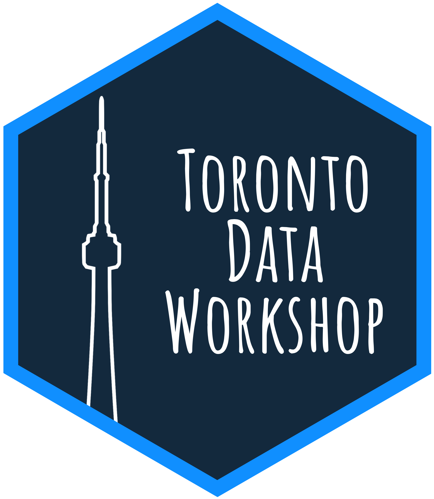

```{r, out.width= "35%"}
 
```

# Overview

The Toronto Data Workshop (TDW) was co-founded by [Rohan Alexander](https://rohanalexander.com/) and [Kelly Lyons](http://individual.utoronto.ca/klyons/) to bring together researchers from many academic disciplines and industry to collectively consider, collate, share, and disseminate best practices in the critical initial steps in a data science project: data collection; data cleaning; and data storage, retrieval, dissemination, and protection.

Since Fall 2019, our multidisciplinary workshop has brought together academic and industry participants to share what we do in these crucial, yet little discussed, stages of working with data and share data best practices. We meet weekly for an hour and aim to have a roughly even split of participants from academia and industry over the course of each term. Participants come from many fields, including financial tech, digital humanities, and healthcare information, among others. 

Anyone is welcome to attend - you don't need to be affiliated with the university. 

We thank Wendy Duff and the Faculty of Information, University of Toronto, for support for this workshop.


# Location and time

In the Summer Term we will meet Thursdays at 4-5pm (Toronto time) via Zoom. For details and an invitation to attend please [get in touch](mailto:rohan.alexander@utoronto.ca). 


### Summer 2020 Speakers

* *Thursday, 21 May 2020, 4-5pm*  
	**Rohan Alexander** (University of Toronto, Information)  
	[Rohan](rohanalexander.com) is a post-doctoral fellow at the Faculty of Information, University of Toronto. He holds a PhD in Economics from the Australian National University. He will talk about getting data from PDFs into R, with an application to the Kenyan census.
* *Thursday, 28 May 2020, 4-5pm*  
	**Shiro Kuriwaki** (Harvard University, Government)  
	[Shiro](https://www.shirokuriwaki.com/) is a Ph.D. Candidate at the Department of Government, Harvard University. His research focuses on democratic representation in American Politics, for instance cast vote records, public opinion, survey methods, and applied statistics more generally. Shiro will talk about workflows for multiple data analysis projects that draw from common datasets, using Github + RStudio project + Dataverse + custom R packages: A case study of the Cooperative Congressional Election Study survey data.
* *Thursday, 4 June 2020, 4-5pm*  
	**Marija Pejcinovska** (University of Toronto, Statistics)  
	Marija is a first-year PhD student at the University of Toronto Department of Statistical Sciences. Her research interests (though not yet settled) lie largely in applied statistics and are frequently motivated by modeling challenges that arise mainly in the social sciences. Marija will talk about a project for the WHO focusing on maternal mortality across many countries.
* *Thursday, 11 June 2020, 4-5pm*  
	**Harrison Jones** (Deloitte)  
	[Harrison](https://ca.linkedin.com/in/harrison-jones-a9947b60) is a Manager at Deloitte in Toronto, where he focuses on data analytics and machine learning in the property & casualty insurance, life insurance, health insurance, pensions, and the public sector. Harrison will talk about using R with actuarial data.
* *Thursday, 18 June 2020, 4-5pm*  
	**Sharla Gelfand** (Freelance R Developer)  
	[Sharla](https://sharla.party/) is a freelance R developer specializing in enabling easy access to data and replacing manual, redundant processes with ones that are automated, reproducible, and repeatable. Sharla will talk about the #TwoFunctionsMostDays project, which is a project dedicated to sharing R functions and tips on Twitter. This talk will cover the project itself and discuss other things, like how she discovers new functions and how to create a small, reproducible, but meaningful example.
* *Thursday, 25 June 2020, 4-5pm*  
	**A Mahfouz** (University of Toronto, Information)  
	A is a Master of Information student at the University of Toronto with a background in geography. Their prior work has been largely concerned with data pipelines. A will talk about geographic data cleaning, extracting mappable data from Google Directions API results in Python.
* *Thursday, 2 July 2020, 4-5pm*  
	**Heather McBrien** (University of Toronto, Statistics)  
	Heather just graduated from the Statistics BSc program at the University of Toronto, and is interested in modelling in population health research, particularly using novel data sources to answer questions where traditional data is lacking. Heather will talk about cleaning and using new data sets for examining opioid mortality trends in the US, in R, and results from those data.
* *Thursday, 9 July 2020, 4-5pm*  
	**Roxanne Chui** (University of Toronto, Information)  
	Roxanne is an emerging anthropological data science professional. She did her BSc program in Forensic anthropology and worked in the pharmaceutical industry before doing her Masters in data science. She is passionate about excavating context from data for predicting future patterns of human behaviour. Roxanne will talk about an EDA approach to Tokyo AirBnB datasets and pattern discovery in listing prices using R - 'What do we have here among  millions of observations?'
* *Thursday, 16 July 2020, 4-5pm*  
	**Aije Egwaikhide** (IBM)  
	Aije will talk about getting data ready for OCR training.
* *Thursday, 23 July 2020, 11am-noon*  
	**Marta Kołczyńska** (Institute of Political Studies of the Polish Academy of Sciences)  
	[Marta](https://martakolczynska.com/) is an Assistant Professor at the Institute of Political Studies of the Polish Academy of Sciences and a visiting researcher in the Probabilistic Machine Learning Group, Department of Computer Science, Aalto University. Her research interests include comparative analyses of political attitudes and behavior across nations and over time, as well as the methodology of comparative research, in particular cross-national surveys. Marta will talk about cleaning survey data, in particular a project in which she gathers political trust items from different cross-national survey datasets to model time trends, and the tools she has developed to facilitate this work.
* *Thursday, 30 July 2020, 4-5pm*  
	**Alex Luscombe** (University of Toronto, Criminology and Sociolegal Studies)  
	**Alexander McClelland** (University of Ottawa, Criminology)  
	[Alex Luscombe](https://criminology.utoronto.ca/facultyandstaff/graduate-students/alex-luscombe/) is a PhD student in the Centre for Criminology & Sociolegal Studies and a Junior Fellow at Massey College. [Alexander McClelland](https://www.alexandermcclelland.ca/) is a sociolegal researcher and Banting Postdoctoral Fellow at the University of Ottawa in the Department of Criminology. 	They will talk about [Policing the Pandemic](https://www.policingthepandemic.ca/), which is a project that was launched on 4 April, 2020, to track and visualize the massive and extraordinary expansions of police power in response to the COVID-19 Pandemic and the unequal patterns of enforcement that may arise as  a result. 
* *Thursday, 6 August 2020, 4-5pm*  
	**Monica Alexander** (University of Toronto, Statistics and Sociology)  
	[Monica](https://www.monicaalexander.com/) is an Assistant Professor in Statistical Sciences and Sociology at the University of Toronto. She received her PhD in Demography from the University of California, Berkeley. Monica will talk about preparing demographic data.
* *Thursday, 13 August 2020, 4-5pm*  
	**Richard Iannone** (R Studio)  
	[Rich](https://twitter.com/riannone) is a Software Engineer at R Studio. Rich will talk about [`pointblank`](https://github.com/rich-iannone/pointblank), which is an R package that allows workflows that allow for nice and easy data validation in reproducible documents.
	


	


### Winter 2020 Term Speakers

* *Noon, Friday, 24 January 2020*  
    [Steven Pimentel](https://www.linkedin.com/in/steve-pimentel-3610a11/) (U of T, business intelligence) 
* *Noon, Friday, 31 January 2020*  
    [Arik Senderovich](https://ischool.utoronto.ca/profile/arik-senderovich/) (U of T, Information)  
* *Noon, Friday, 7 February 2020*  
    [Kathy Chung](https://www.linkedin.com/in/kathy-k-y-chung-a5b46698/) (U of T, Records of Early English Drama)
* *Noon, Friday, 14 February 2020*  
    [Josh Harris](https://www.linkedin.com/in/josh-harris-86188983/) ([KOHO](https://www.koho.ca/))
* *Noon, Friday, 28 February 2020*  
    [Eugene Joh](https://www.linkedin.com/in/eugejoh/) (St. Michael's Hospital)
* *Noon, Friday, 6 March 2020*  
    [Fatemeh Nargesian](https://www.cs.rochester.edu/people/faculty/nargesian-fatemeh/index.html) (University of Rochester, Computer Science)


### Fall 2019 Term Speakers
 
* *Noon, Thursday, 26 September 2019*  
    [Periklis Andritsos](http://www.cs.toronto.edu/~periklis/) (ODAIA & U of T, Information)  
* *Noon, Thursday, 10 October 2019*  
    [Hassan Teimoori](https://ca.linkedin.com/in/hassan-teimoori) (Deloitte, Omnia AI)  
    [Ludovic Rheault](https://ludovicrheault.weebly.com/) (U of T, Political Science)
* *Noon, Wednesday, 16 October 2019*  
    [Lauren Kennedy](https://au.linkedin.com/in/lauren-kennedy-783864bb) (Columbia University)  
* *Noon, Thursday, 24 October 2019*  
    [Sharla Gelfand](https://sharla.party/) (Freelance R and Shiny developer)  
* *Noon, Thursday, 7 November 2019*  
    [Maria D'Angelo](https://ca.linkedin.com/in/mariacdangelo) (Delphia)  
    [Hareem Naveed](https://ca.linkedin.com/in/hareemnaveed) (Munich Re)    
* *Noon, Thursday, 21 November 2019*  
    [Michelle Alexopoulos](http://homes.chass.utoronto.ca/~malex/) (U of T, Economics)  
    [Paraskevi Massara](https://ca.linkedin.com/in/paraskevi-massara-597326a0) (U of T, Medicine)  


If you would like to receive an occasional email about the series, please [get in touch](mailto:rohan.alexander@utoronto.ca). 
